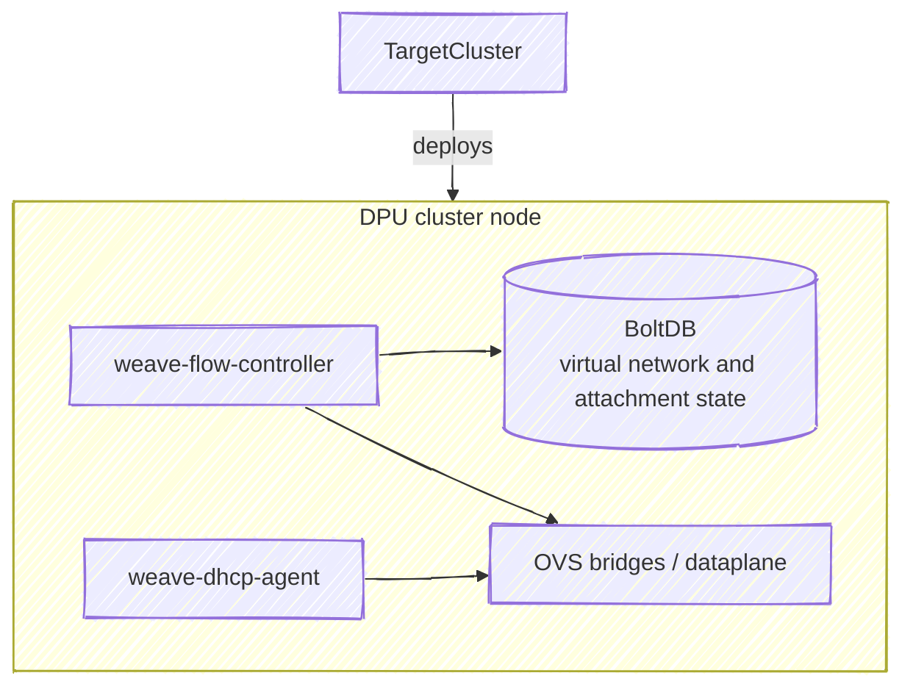

> [!NOTE]
> The DOCA Weave service is a technology preview and is not recommended for production use.

[[_TOC_]]

## Overview

The DOCA Weave DPUService targets east-west network isolation on NVIDIA BlueField 4 DPUs used with ConnectX-9 east-west NICs.
On the Vera-Rubin platform, the Advanced Secure Trusted Resource Architecture (ASTRA) implements a zero-trust system boundary: the host cannot talk to the DPU directly, while the DPU still drives the E/W ConnectX-9 path.
DOCA Weave layers an isolation architecture on that model: isolation is enforced on the DPU, autonomously and independently of the host.
Using Open vSwitch (OVS) on the BlueField to manage ConnectX-9 E-Switches, Weave injects hardware-accelerated VXLAN encapsulation and decapsulation from the DPU toward the E/W NICs, so host traffic is transparently tunneled while tenant separation stays in the DPU dataplane.

Weave also supplies overlay DHCP on the per-NIC DHCP bridges, rounding out tenant connectivity.
A straightforward overlay-to-underlay address mapping avoids a dedicated routing layer on the overlay - underlay routing (including features such as route summarization) carries scalability to very large node counts.
Each BlueField 4 hosts a gRPC control plane above flow programming (NetworkIsolation in this release), keeping forwarding on hardware for near line-rate encapsulation with minimal added latency.

This document describes how the Weave service behaves on the DPU - components, `vpcctl`, virtual networks, and worked examples.

### Key Features

* East-west isolation: Per-tenant overlay traffic separated on the DPU using VXLAN and OVS forwarding.
* Multi-NIC underlay: support for multiple east-west NICs.
* Per-DPU virtual network management: control virtual networks and attachments to those networks per DPU.

## Underlay configuration

DOCA Weave uses several OVS bridges per east-west NIC. Names come from `weaveFlowController.underlayConfigMapData.interfaces[]` in `DPUServiceConfiguration`

### Bridges you must provide

The flow controller expects these bridges to already exist on each DPU (names come from `underlayInterface` in `underlayConfigMapData.interfaces[]`). How to create and wire them is covered in the deployment guide.

| Bridge (example) | Config field | Role |
|------------------|--------------|------|
| `br-underlay-n0`, `br-underlay-n1` | `underlayInterface` | Underlay fabric egress, carries the `/31` IPv4 used for VXLAN encapsulation |

### Bridges created by Weave

DOCA Weave creates per-NIC bridges according to the list you provide in `underlayConfigMapData` (`dhcpBridgeName`, `dropBridgeName`).

| Bridge (example) | Config field | Role |
|------------------|--------------|------|
| `br-dhcp-n0`, `br-dhcp-n1` | `dhcpBridgeName` | Overlay DHCP (`weave-dhcp-agent`) |
| `br-drop-n0`, `br-drop-n1` | `dropBridgeName` | Drop path programmed by `weave-flow-controller` |

## Architecture

DOCA Weave runs on each DPU. It leverages OVS-DOCA for dataplane forwarding (bridges and switching where tenant traffic is switched and tunneled).

It is composed of three parts:

* `weave-flow-controller`: exposes the NetworkIsolation gRPC API on a local Unix socket, reconciles OVS after events such as a restart, and programs tenant/VXLAN bridges and flows.
* `weave-dhcp-agent`: provides overlay DHCP on the per-NIC DHCP bridges.
* `vpcctl`: CLI for the NetworkIsolation API, mainly for evaluation, development, and testing ([usage and examples](#vpcctl)).



### weave-flow-controller

Persists virtual network and attachment state, coordinates with `weave-dhcp-agent` over gRPC, and programs OVS for isolation and VXLAN.

#### weave-flow-controller environment variables

Set these on the `weave-flow-controller` `DPUService` / `DPUServiceConfiguration`.

| Environment variable | Default when unset | Role |
|----------------------|--------------------|------|
| `GRPC_SOCKET_PATH` | `/var/run/dpf/weave/grpc/flow-controller.sock` | Unix socket for the NetworkIsolation gRPC server. |
| `DHCP_SOCKET_PATH` | `/var/run/dpf/weave/grpc/dhcp.sock` | Unix socket for the `weave-dhcp-agent` gRPC service the flow controller calls. |
| `DB_FILE_PATH` | `/var/lib/dpf/weave/db/db.bolt` | BoltDB path for virtual network state. |
| `UNDERLAY_CONFIG_FILE` | `/var/lib/dpf/weave/flow-controller/underlay-config.yaml` | Underlay YAML consumed by the flow controller. |
| `RECONCILE_INTERVAL` | `2m` | Interval between reconcile attempts for failed items. |
| `ENABLE_SRC_BASED_ROUTE` | `true` | When true, mirror selected kernel IPv4 routes into OVS so underlay traffic follows source-based routing. |

When `ENABLE_SRC_BASED_ROUTE` is true, the flow controller mirrors selected kernel IPv4 routes into OVS. It copies main-table routes that have a destination prefix and a non-zero IPv4 gateway. For policy routing, use `ip rule` entries in `from <source> lookup <table>` form and define the routes in that table so they can sync to OVS route rules. Routes with no destination, on-link routes without a gateway, and rules in other forms are not mirrored.

### weave-dhcp-agent

Serves overlay DHCP on bridges such as `br-dhcp-n0` and `br-dhcp-n1`, aligned with `dhcpBridgeName` and `overlayDHCPInterface` in the flow-controller configuration. When `dhcpNetworks.createNADs` is true, the chart creates Multus NetworkAttachmentDefinitions.

#### weave-dhcp-agent environment variables

Set these on the `weave-dhcp-agent` `DPUService` / `DPUServiceConfiguration`.

| Environment variable | Default when unset | Role |
|----------------------|--------------------|------|
| `GRPC_SOCKET_PATH` | `/var/run/dpf/weave/grpc/dhcp.sock` | Unix socket for the DHCPAgentConfig gRPC server. Use the same path as `DHCP_SOCKET_PATH` on `weave-flow-controller` so the flow controller reaches this agent. |
| `STATE_FILE_PATH` | `/var/lib/dpf/weave/dhcp/last-applied-state.json` | JSON file where the DHCP agent stores last applied state. |
| `MANAGED_INTERFACES` | *(empty list)* | Comma-separated interface names the DHCP agent manages (same semantics as `--managed-interfaces`). When unset, the list is empty. |

## NetworkIsolation API - VirtualNetworks and VirtualNetworkAttachments

The `weave-flow-controller` exposes the NetworkIsolation gRPC API on each DPU. It provides create, delete, get, and list methods for:

* `VirtualNetwork` - isolation boundary for east-west overlay traffic, defined by an IPv4 subnet and a VXLAN VNI.
* `VirtualNetworkAttachment` - binds an attachment to a `VirtualNetwork` on a specific east-west NIC.

### Status

Both object types expose lifecycle state under `status.state`.

| Field | Description |
|-------|-------------|
| `status.state.phase` | Current lifecycle phase (see table below) |
| `status.state.reason` | Machine-readable token for the phase (for example `Internal` on `PHASE_ERROR`) |
| `status.state.message` | Human-readable detail; on `PHASE_ERROR`, read this first when debugging |

| Phase | Meaning |
|-------|---------|
| `PHASE_UNSPECIFIED` | Uninitialized or unknown |
| `PHASE_PENDING` | Object was registered but was not fully handled (transient during create) |
| `PHASE_READY` | Handling completed, virtual network or attachment is usable |
| `PHASE_DELETING` | Delete was requested, removal is in progress (`metadata.deletionTimestamp` is set) |
| `PHASE_ERROR` | Last operation failed; `reason` and `message` describe the failure |

After `create-vnet` or `create-attachment`, the response usually shows `PHASE_READY` or `PHASE_ERROR` once the synchronous apply completes. Poll with `get-vnet` / `get-attachment` if another client holds the flow-controller lock (gRPC `Aborted` with `pending`) or after an OVS restart. Do not use overlay connectivity until `PHASE_READY`.

On `PHASE_ERROR`, inspect `status.state.message` and `weave-flow-controller` logs on that DPU. The flow controller retries failed objects on a background interval (default every two minutes). Typical causes include missing or misconfigured underlay bridges, invalid `nicId` / `pfId`, parent virtual network not in `PHASE_READY` when creating an attachment, or OVS programming failures after restart.

`VirtualNetworkAttachment` objects use the same `status.state` phases. When `PHASE_READY`, an attachment may also include `status.hostIpv4`.

Example when apply succeeds (`PHASE_READY`):

```json
{
  "virtualNetwork": {
    "spec": {
      "id": "vnet1",
      "subnetIpv4": "10.0.0.0/12",
      "vni": 100
    },
    "status": {
      "state": {
        "phase": "PHASE_READY"
      }
    }
  }
}
```

Example when apply fails (object is still returned, gRPC call succeeds, `PHASE_ERROR`):

```json
{
  "virtualNetwork": {
    "spec": {
      "id": "vnet1",
      "subnetIpv4": "10.0.0.0/12",
      "vni": 100
    },
    "status": {
      "state": {
        "phase": "PHASE_ERROR",
        "reason": "Internal",
        "message": "failed to apply virtual network: ..."
      }
    }
  }
}
```

Some failures are reported only as gRPC errors (no persisted object), for example `AlreadyExists` on duplicate `id`, `NotFound` on get/delete of a missing object, or `FailedPrecondition` when deleting a virtual network that still has attachments or creating an attachment while the parent virtual network is not `PHASE_READY`.

### VirtualNetwork

A `VirtualNetwork` is the isolation boundary for east-west overlay traffic. It is defined by an IPv4 subnet and a VXLAN VNI. One `VirtualNetwork` on a DPU can be used by multiple attachments on that DPU, including across NICs. Overlay connectivity between two PF attachments on the same node is not yet supported (see [Limitations](#limitations)).

| Field | Description |
|-------|-------------|
| `id` | Unique identifier for this virtual network on the DPU |
| `subnetIpv4` | Overlay subnet (CIDR), prefix length must match `overlayNetworkPrefixLength` in `underlayConfigMapData` |
| `vni` | VXLAN VNI (20-bit usable value, bits 20-23 of the 24-bit on-wire VNI are reserved, range 1-1048575) |
| `status.state` | Lifecycle state, see [Status](#status) |

> [!IMPORTANT]
> A `VirtualNetwork` is the tenant boundary, defined by the (subnet, VNI) pair. Every DPU that participates in that tenant must use the same subnet and VNI. PFs only share an overlay when their virtual networks match on both values, mismatched subnets or VNIs across DPUs break isolation and connectivity.

Example when `status.state.phase` is `PHASE_READY`:

```json
{
  "virtualNetwork": {
    "spec": {
      "id": "vnet1",
      "subnetIpv4": "10.0.0.0/12",
      "vni": 100
    },
    "status": {
      "state": {
        "phase": "PHASE_READY"
      }
    }
  }
}
```

For `PHASE_ERROR` and other phases, see [Status](#status).

### VirtualNetworkAttachment

A virtual network attachment binds one host PF to a `VirtualNetwork` on a specific east-west NIC path. Create one attachment per PF that should join the overlay. `nicId` selects the NIC, `attachmentPf.pfId` is the specific host PF to attach.

| Field | Description |
|-------|-------------|
| `id` | Unique attachment identifier on the DPU |
| `vnetId` | Target `VirtualNetwork` `id` |
| `nicId` | NIC identifier this virtual network is bound to, MAC address of one of the NIC's host-facing PFs |
| `attachmentPf.pfId` | Host PF to attach, MAC address of that PF |
| `attachmentType` | `ATTACHMENT_TYPE_PF` only (`vf` not supported, see [Limitations](#limitations)) |
| `status.hostIpv4` | Overlay address assigned to the host PF when applicable |
| `status.state` | Lifecycle state, see [Status](#status) |

> [!NOTE]
> `nicId` and `pfId` are not always the same. `nicId` is the NIC this virtual network is bound to: the MAC of any host-facing PF on that NIC. `attachmentPf.pfId` is the specific host PF to attach. When a rail has only one PF, both are often set to that PF's MAC.

Example object shape when `PHASE_READY` (`status.hostIpv4` is illustrative, phases in [Status](#status)):

```json
{
  "virtualNetworkAttachment": {
    "spec": {
      "attachmentPf": {
        "pfId": "94:6d:ae:4f:41:50"
      },
      "attachmentType": "ATTACHMENT_TYPE_PF",
      "id": "attach1",
      "nicId": "94:6d:ae:4f:41:50",
      "vnetId": "vnet1"
    },
    "status": {
      "hostIpv4": "10.1.0.1",
      "state": {
        "phase": "PHASE_READY"
      }
    }
  }
}
```

## vpcctl

`vpcctl` is a CLI for the NetworkIsolation gRPC API exposed by `weave-flow-controller`. Integrations should call that API with a gRPC client directly, the DOCA Weave image also ships `vpcctl` so you can interact with the flow controller co-located on the same DPU.

Run `/vpcctl` on each DPU via `kubectl exec` into the `weave-flow-controller` pod on that node. Virtual network state is per DPU. Subcommands that return objects (`create-vnet`, `get-vnet`, `list-vnet`, `create-attachment`, `get-attachment`, `list-attachment`) print JSON to stdout.

Default gRPC socket: `/var/run/dpf/weave/grpc/flow-controller.sock`. Run `/vpcctl --help`. If you change the socket, set `GRPC_SOCKET_PATH` on `weave-flow-controller` and `VPCCTL_SOCKET_PATH` on `vpcctl` to the same path.

Subcommands: `create-vnet`, `get-vnet`, `list-vnet`, `delete-vnet`, `create-attachment`, `get-attachment`, `list-attachment`, `delete-attachment`.

### Create a VirtualNetwork

| Flag | Description |
|------|-------------|
| `--id` | Virtual network ID (optional on create, server assigns if omitted) |
| `--subnet-v4` | Subnet CIDR |
| `--vni` | VNI |

```shell
/vpcctl create-vnet --id <id> --subnet-v4 <subnet_ipv4> --vni <vni>
```

Example: `/vpcctl create-vnet --id vnet1 --subnet-v4 10.0.0.0/12 --vni 100`. Confirm `status.state.phase` is `PHASE_READY` before use (see [Status](#status)).

### Create a VirtualNetworkAttachment

| Flag | Description |
|------|-------------|
| `--id` | Attachment ID (optional on create, server may assign) |
| `--vnet-id` | Target virtual network `id` |
| `--nic-id` | NIC identifier this virtual network is bound to, MAC address of one of the NIC's host-facing PFs |
| `--type` | `pf` only |
| `--pf` | MAC of the specific host PF to attach (`attachmentPf.pfId`) |
| `--rep` | Representor netdev of the host attachment. When set, `--nic-id`, and `--pf` are derived from the matching devlink port and must not be provided |

```shell
# with nic-id and pf
/vpcctl create-attachment --id <id> --vnet-id <vnet_id> --type pf --nic-id <nic_mac> --pf <pf>
# with rep
/vpcctl create-attachment --id <id> --vnet-id <vnet_id> --type pf --rep <rep>
```

Examples:
```shell
# with nic-id and pf
/vpcctl create-attachment --id attach1 --vnet-id vnet1 --type pf --nic-id 94:6d:ae:4f:41:50 --pf 94:6d:ae:4f:41:50
# with rep
/vpcctl create-attachment --id attach1 --vnet-id vnet1 --type pf --rep A1c1pf0
```

Refer to [VirtualNetworkAttachment](#virtualnetworkattachment) for response fields.

### Get, list, and delete

* `get-vnet` - `--id` (virtual network ID), prints one `VirtualNetwork`.
* `get-attachment` - `--id` (attachment ID), prints one `VirtualNetworkAttachment`.
* `list-vnet` / `list-attachment` - Optional filters (`--vni`, `--vnet-id`, `--nic-id`) per `vpcctl --help`.
* `delete-vnet` / `delete-attachment` - `--id` of the object to remove.

```shell
/vpcctl get-vnet --id <vnet-id>
/vpcctl get-attachment --id <id>
/vpcctl list-vnet
/vpcctl list-attachment
/vpcctl delete-attachment --id <id>
/vpcctl delete-vnet --id <id>
```

### Removing VirtualNetwork objects

`VirtualNetwork` and `VirtualNetworkAttachment` objects live on each DPU. To drop overlay state only, run the following in the `weave-flow-controller` pod on every DPU where those objects exist (attachments first):

1. `/vpcctl delete-attachment --id <id>`
2. `/vpcctl delete-vnet --id <id>`

## Example: one shared VirtualNetwork, one attachment per host PF

### Overview

This walkthrough builds one east-west overlay tenant across two DPU nodes. All four host PFs (two rails × two nodes) join the same `VirtualNetwork` on the same VXLAN segment. After configuration, you validate with `PHASE_READY`, overlay addresses on the PFs, and overlay ping tests. Expect cross-node connectivity on the same rail or across rails.

### Setup

* Two Kubernetes worker nodes, each with a DPU running DOCA Weave (`weave-flow-controller` and `weave-dhcp-agent`).
* Two east-west NIC rails per node (`n0`, `n1`), each with a host PF you attach to the overlay (`--type pf`).
* Replace `<weave-flow-controller-dpu-worker-1>` and `<weave-flow-controller-dpu-worker-2>` with the flow-controller pod names on those nodes (for example `kubectl get pods -n dpf-operator-system -o wide`).
* Run `vpcctl` in the pod on the DPU you are configuring. Virtual network state is per DPU: create the same `VirtualNetwork` on every participating DPU, then create only that node’s attachments from that node’s pod.

### Overlay

One tenant on every participating DPU. Use the same `id`, subnet, and VNI on each DPU.

| Item | Value |
|------|-------|
| Virtual network `id` | `shared-vnet` |
| Subnet (`--subnet-v4` / `subnetIpv4`) | `10.0.0.0/12` |
| VNI | `100` |

Objects created (IDs are stable across the lab, MACs are examples—use your PF MACs):

| DPU (pod) | `VirtualNetwork` | `VirtualNetworkAttachment` IDs |
|-----------|------------------|--------------------------------|
| worker-1 | `shared-vnet` | `node1-n0` (rail n0), `node1-n1` (rail n1) |
| worker-2 | `shared-vnet` | `node2-n0` (rail n0), `node2-n1` (rail n1) |

### Configure

```shell
# Overlay parameters
subnetV4=10.0.0.0/12
VNI=100

# --- Worker 1 (first DPU) ---

# Create the shared virtual network on worker-1's DPU
kubectl exec -it -n dpf-operator-system <weave-flow-controller-dpu-worker-1> -- /vpcctl create-vnet --id shared-vnet --subnet-v4 "$subnetV4" --vni $VNI

# MACs for worker-1 host PFs on rail n0 and n1 (replace with your addresses)
MAC_NODE1_N0=00:11:22:33:44:55
MAC_NODE1_N1=11:22:33:44:55:66

# Attach worker-1 PF on rail n0 to shared-vnet
kubectl exec -it -n dpf-operator-system <weave-flow-controller-dpu-worker-1> -- /vpcctl create-attachment --id node1-n0 --vnet-id shared-vnet --type pf --nic-id $MAC_NODE1_N0 --pf $MAC_NODE1_N0

# Attach worker-1 PF on rail n1 to shared-vnet
kubectl exec -it -n dpf-operator-system <weave-flow-controller-dpu-worker-1> -- /vpcctl create-attachment --id node1-n1 --vnet-id shared-vnet --type pf --nic-id $MAC_NODE1_N1 --pf $MAC_NODE1_N1

# --- Worker 2 (second DPU) ---

# Create the same virtual network on worker-2's DPU (same id, subnet, and VNI as worker-1)
kubectl exec -it -n dpf-operator-system <weave-flow-controller-dpu-worker-2> -- /vpcctl create-vnet --id shared-vnet --subnet-v4 "$subnetV4" --vni $VNI

MAC_NODE2_N0=aa:bb:cc:dd:ee:ff
MAC_NODE2_N1=aa:bb:cc:dd:ee:00

# Attach worker-2 PF on rail n0 to shared-vnet
kubectl exec -it -n dpf-operator-system <weave-flow-controller-dpu-worker-2> -- /vpcctl create-attachment --id node2-n0 --vnet-id shared-vnet --type pf --nic-id $MAC_NODE2_N0 --pf $MAC_NODE2_N0

# Attach worker-2 PF on rail n1 to shared-vnet
kubectl exec -it -n dpf-operator-system <weave-flow-controller-dpu-worker-2> -- /vpcctl create-attachment --id node2-n1 --vnet-id shared-vnet --type pf --nic-id $MAC_NODE2_N1 --pf $MAC_NODE2_N1
```

### Validate

Confirm `PHASE_READY` with `get-vnet` / `get-attachment` or `list-vnet` / `list-attachment` on each DPU. See [Status](#status) for phases and errors. Run `dhclient` on each host PF. Ping across nodes should work on the same rail (for example `node1-n0` to `node2-n0`) and across rails (for example `node1-n0` to `node2-n1`).

### Response examples

`VirtualNetwork` after `create-vnet` for `shared-vnet`:

```json
{
  "virtualNetwork": {
    "spec": {
      "id": "shared-vnet",
      "subnetIpv4": "10.0.0.0/12",
      "vni": 100
    },
    "status": {
      "state": {
        "phase": "PHASE_READY"
      }
    }
  }
}
```

`VirtualNetworkAttachment` after each `create-attachment` (`hostIpv4` values are illustrative):

```json
{
  "virtualNetworkAttachment": {
    "spec": {
      "attachmentPf": {
        "pfId": "00:11:22:33:44:55"
      },
      "attachmentType": "ATTACHMENT_TYPE_PF",
      "id": "node1-n0",
      "nicId": "00:11:22:33:44:55",
      "vnetId": "shared-vnet"
    },
    "status": {
      "hostIpv4": "10.0.0.1",
      "state": {
        "phase": "PHASE_READY"
      }
    }
  }
}
```

```json
{
  "virtualNetworkAttachment": {
    "spec": {
      "attachmentPf": {
        "pfId": "11:22:33:44:55:66"
      },
      "attachmentType": "ATTACHMENT_TYPE_PF",
      "id": "node1-n1",
      "nicId": "11:22:33:44:55:66",
      "vnetId": "shared-vnet"
    },
    "status": {
      "hostIpv4": "10.32.0.1",
      "state": {
        "phase": "PHASE_READY"
      }
    }
  }
}
```

```json
{
  "virtualNetworkAttachment": {
    "spec": {
      "attachmentPf": {
        "pfId": "aa:bb:cc:dd:ee:ff"
      },
      "attachmentType": "ATTACHMENT_TYPE_PF",
      "id": "node2-n0",
      "nicId": "aa:bb:cc:dd:ee:ff",
      "vnetId": "shared-vnet"
    },
    "status": {
      "hostIpv4": "10.0.0.41",
      "state": {
        "phase": "PHASE_READY"
      }
    }
  }
}
```

```json
{
  "virtualNetworkAttachment": {
    "spec": {
      "attachmentPf": {
        "pfId": "aa:bb:cc:dd:ee:00"
      },
      "attachmentType": "ATTACHMENT_TYPE_PF",
      "id": "node2-n1",
      "nicId": "aa:bb:cc:dd:ee:00",
      "vnetId": "shared-vnet"
    },
    "status": {
      "hostIpv4": "10.32.0.41",
      "state": {
        "phase": "PHASE_READY"
      }
    }
  }
}
```

### Teardown

Remove overlay objects on each DPU where you created them. Delete attachments before virtual networks.

```shell
# --- Worker 1 ---

# Remove attachments first
kubectl exec -it -n dpf-operator-system <weave-flow-controller-dpu-worker-1> -- /vpcctl delete-attachment --id node1-n0
kubectl exec -it -n dpf-operator-system <weave-flow-controller-dpu-worker-1> -- /vpcctl delete-attachment --id node1-n1

# Remove virtual network after all its attachments are gone on this DPU
kubectl exec -it -n dpf-operator-system <weave-flow-controller-dpu-worker-1> -- /vpcctl delete-vnet --id shared-vnet

# --- Worker 2 ---

kubectl exec -it -n dpf-operator-system <weave-flow-controller-dpu-worker-2> -- /vpcctl delete-attachment --id node2-n0
kubectl exec -it -n dpf-operator-system <weave-flow-controller-dpu-worker-2> -- /vpcctl delete-attachment --id node2-n1
kubectl exec -it -n dpf-operator-system <weave-flow-controller-dpu-worker-2> -- /vpcctl delete-vnet --id shared-vnet
```

On each worker pod, `list-attachment` and `list-vnet` should no longer list these objects.

## Example: two VirtualNetworks (VNI 100 and 101) - VNI-based isolation

### Overview

This walkthrough builds two overlay tenants on the same subnet but different VNIs. Rail `n0` uses VNI 100, rail `n1` uses VNI 101. PFs on the same VNI should reach each other across nodes, PFs on different VNIs should not (isolation by VNI). You validate with `PHASE_READY`, overlay addresses, same-VNI ping success, and cross-VNI ping failure.

### Setup

* Same lab assumptions as the [shared VirtualNetwork example](#example-one-shared-virtualnetwork-one-attachment-per-host-pf): two DPU workers, two east-west rails per node, Weave deployed, and flow-controller pod names substituted for `<weave-flow-controller-dpu-worker-1>` / `<weave-flow-controller-dpu-worker-2>`.
* Create both `VirtualNetwork` objects on every participating DPU.
* Create attachments only from each node’s flow-controller pod, binding the PF on `n0` to `vnet-vni100` and the PF on `n1` to `vnet-vni101`.
* Adjust example MACs to your hardware.

### Overlay

Same subnet for both tenants, VNI separates rails. Replicate each virtual network on every participating DPU.

| Virtual network `id` | Subnet | VNI | Rail / PF |
|----------------------|--------|-----|-----------|
| `vnet-vni100` | `10.0.0.0/12` | `100` | `n0` on each node |
| `vnet-vni101` | `10.0.0.0/12` | `101` | `n1` on each node |

| DPU (pod) | `VirtualNetwork` objects | `VirtualNetworkAttachment` IDs |
|-----------|--------------------------|--------------------------------|
| worker-1 | `vnet-vni100`, `vnet-vni101` | `v100-node1-n0`, `v101-node1-n1` |
| worker-2 | `vnet-vni100`, `vnet-vni101` | `v100-node2-n0`, `v101-node2-n1` |

### Configure

```shell
subnetV4=10.0.0.0/12
VNI_A=100   # tenant for rail n0
VNI_B=101   # tenant for rail n1

# --- Worker 1 ---

# Virtual network for VNI 100 (rail n0 tenant) on worker-1's DPU
kubectl exec -it -n dpf-operator-system <weave-flow-controller-dpu-worker-1> -- /vpcctl create-vnet --id vnet-vni100 --subnet-v4 "$subnetV4" --vni $VNI_A

# Virtual network for VNI 101 (rail n1 tenant) on worker-1's DPU
kubectl exec -it -n dpf-operator-system <weave-flow-controller-dpu-worker-1> -- /vpcctl create-vnet --id vnet-vni101 --subnet-v4 "$subnetV4" --vni $VNI_B

MAC_NODE1_N0=00:11:22:33:44:55
MAC_NODE1_N1=11:22:33:44:55:66

# Bind worker-1 n0 PF to the VNI 100 overlay
kubectl exec -it -n dpf-operator-system <weave-flow-controller-dpu-worker-1> -- /vpcctl create-attachment --id v100-node1-n0 --vnet-id vnet-vni100 --type pf --nic-id $MAC_NODE1_N0 --pf $MAC_NODE1_N0

# Bind worker-1 n1 PF to the VNI 101 overlay
kubectl exec -it -n dpf-operator-system <weave-flow-controller-dpu-worker-1> -- /vpcctl create-attachment --id v101-node1-n1 --vnet-id vnet-vni101 --type pf --nic-id $MAC_NODE1_N1 --pf $MAC_NODE1_N1

# --- Worker 2 ---

# Replicate both virtual networks on worker-2's DPU (same ids, subnet, and VNIs)
kubectl exec -it -n dpf-operator-system <weave-flow-controller-dpu-worker-2> -- /vpcctl create-vnet --id vnet-vni100 --subnet-v4 "$subnetV4" --vni $VNI_A
kubectl exec -it -n dpf-operator-system <weave-flow-controller-dpu-worker-2> -- /vpcctl create-vnet --id vnet-vni101 --subnet-v4 "$subnetV4" --vni $VNI_B

MAC_NODE2_N0=aa:bb:cc:dd:ee:ff
MAC_NODE2_N1=bb:cc:dd:ee:ff:00

# Bind worker-2 n0 PF to VNI 100 (should ping v100-node1-n0, not v101-* attachments)
kubectl exec -it -n dpf-operator-system <weave-flow-controller-dpu-worker-2> -- /vpcctl create-attachment --id v100-node2-n0 --vnet-id vnet-vni100 --type pf --nic-id $MAC_NODE2_N0 --pf $MAC_NODE2_N0

# Bind worker-2 n1 PF to VNI 101
kubectl exec -it -n dpf-operator-system <weave-flow-controller-dpu-worker-2> -- /vpcctl create-attachment --id v101-node2-n1 --vnet-id vnet-vni101 --type pf --nic-id $MAC_NODE2_N1 --pf $MAC_NODE2_N1
```

### Validate

Confirm `PHASE_READY` with `get-vnet` / `get-attachment` or `list-vnet` / `list-attachment` on each DPU. See [Status](#status) for phases and errors. Run `dhclient` on each host PF. PFs on the same VNI (for example `v100-node1-n0` and `v100-node2-n0`) should ping each other, PFs on different VNIs (n0 vs n1) should fail.

### Response examples

`VirtualNetwork` after each `create-vnet`:

```json
{
  "virtualNetwork": {
    "spec": {
      "id": "vnet-vni100",
      "subnetIpv4": "10.0.0.0/12",
      "vni": 100
    },
    "status": {
      "state": {
        "phase": "PHASE_READY"
      }
    }
  }
}
```

```json
{
  "virtualNetwork": {
    "spec": {
      "id": "vnet-vni101",
      "subnetIpv4": "10.0.0.0/12",
      "vni": 101
    },
    "status": {
      "state": {
        "phase": "PHASE_READY"
      }
    }
  }
}
```

`VirtualNetworkAttachment` after each `create-attachment` (`hostIpv4` values are illustrative):

```json
{
  "virtualNetworkAttachment": {
    "spec": {
      "attachmentPf": {
        "pfId": "00:11:22:33:44:55"
      },
      "attachmentType": "ATTACHMENT_TYPE_PF",
      "id": "v100-node1-n0",
      "nicId": "00:11:22:33:44:55",
      "vnetId": "vnet-vni100"
    },
    "status": {
      "hostIpv4": "10.0.0.1",
      "state": {
        "phase": "PHASE_READY"
      }
    }
  }
}
```

```json
{
  "virtualNetworkAttachment": {
    "spec": {
      "attachmentPf": {
        "pfId": "aa:bb:cc:dd:ee:ff"
      },
      "attachmentType": "ATTACHMENT_TYPE_PF",
      "id": "v100-node2-n0",
      "nicId": "aa:bb:cc:dd:ee:ff",
      "vnetId": "vnet-vni100"
    },
    "status": {
      "hostIpv4": "10.0.0.41",
      "state": {
        "phase": "PHASE_READY"
      }
    }
  }
}
```

```json
{
  "virtualNetworkAttachment": {
    "spec": {
      "attachmentPf": {
        "pfId": "11:22:33:44:55:66"
      },
      "attachmentType": "ATTACHMENT_TYPE_PF",
      "id": "v101-node1-n1",
      "nicId": "11:22:33:44:55:66",
      "vnetId": "vnet-vni101"
    },
    "status": {
      "hostIpv4": "10.32.0.1",
      "state": {
        "phase": "PHASE_READY"
      }
    }
  }
}
```

```json
{
  "virtualNetworkAttachment": {
    "spec": {
      "attachmentPf": {
        "pfId": "bb:cc:dd:ee:ff:00"
      },
      "attachmentType": "ATTACHMENT_TYPE_PF",
      "id": "v101-node2-n1",
      "nicId": "bb:cc:dd:ee:ff:00",
      "vnetId": "vnet-vni101"
    },
    "status": {
      "hostIpv4": "10.32.0.41",
      "state": {
        "phase": "PHASE_READY"
      }
    }
  }
}
```

### Teardown

Remove overlay objects on each DPU where you created them. Delete attachments before virtual networks.

```shell
# --- Worker 1 ---

kubectl exec -it -n dpf-operator-system <weave-flow-controller-dpu-worker-1> -- /vpcctl delete-attachment --id v100-node1-n0
kubectl exec -it -n dpf-operator-system <weave-flow-controller-dpu-worker-1> -- /vpcctl delete-attachment --id v101-node1-n1
kubectl exec -it -n dpf-operator-system <weave-flow-controller-dpu-worker-1> -- /vpcctl delete-vnet --id vnet-vni100
kubectl exec -it -n dpf-operator-system <weave-flow-controller-dpu-worker-1> -- /vpcctl delete-vnet --id vnet-vni101

# --- Worker 2 ---

kubectl exec -it -n dpf-operator-system <weave-flow-controller-dpu-worker-2> -- /vpcctl delete-attachment --id v100-node2-n0
kubectl exec -it -n dpf-operator-system <weave-flow-controller-dpu-worker-2> -- /vpcctl delete-attachment --id v101-node2-n1
kubectl exec -it -n dpf-operator-system <weave-flow-controller-dpu-worker-2> -- /vpcctl delete-vnet --id vnet-vni100
kubectl exec -it -n dpf-operator-system <weave-flow-controller-dpu-worker-2> -- /vpcctl delete-vnet --id vnet-vni101
```

On each worker pod, `list-attachment` and `list-vnet` should no longer list these objects.

## Monitoring and Troubleshooting

* DPUServices not ready - inspect the deployment and chain hierarchy:

    ```shell
    kubectl describe dpudeployment <name> -n dpf-operator-system
    kubectl -n dpf-operator-system exec deploy/dpf-operator-controller-manager -- /dpfctl describe dpudeployments
    ```

    where `<name>` matches your `DPUDeployment` `metadata.name`. Confirm chart version and image pull secrets match your DPF release.
* Fabric / bridges - `serviceChains`, `DPUServiceInterface`, `peerBridge`, and `underlayConfigMapData` must stay consistent per NIC (including `weave.dpu.nvidia.com/interface` where used).
* `vpcctl` - Run it in the `weave-flow-controller` pod on the DPU (node) you are configuring or debugging. Virtual network and attachment state is stored only on that DPU, `get-vnet` / `list-vnet` show that DPU only. For multi-DPU overlays, create the same virtual networks and attachments on each participating DPU (see [shared-overlay example](#example-one-shared-virtualnetwork-one-attachment-per-host-pf)).
* DHCP - If host PFs do not receive overlay addresses (for example `dhclient` fails), check overlay DHCP on each DPU:

    1. `weave-dhcp-agent` pod is `Ready` on that DPU.
    2. Per NIC, DHCP agent configuration `dhcpNetworks.networks[]` matches flow controller configuration `underlayConfigMapData`: `bridge` = `dhcpBridgeName`, `interfaceName` = `overlayDHCPInterface` (same NIC index on both sides).
    3. If `resourceName` is set (for example `nvidia.com/bf_sf`), the DPU node must advertise that extended resource so the agent can attach to the DHCP bridge.

## Limitations

Technology preview (not for production).

* Address family - Only IPv4 is supported for overlay and underlay traffic in this release.
* Attachments - Only `attachment_type` `pf` is supported for `VirtualNetworkAttachment`, `vf` is not supported.
* Same-node PFs - Overlay connectivity between two PF attachments on the same node is not yet supported, even when they share the same `VirtualNetwork` and VNI.
* VNI - Bits 20-23 of the 24-bit VNI are reserved (see [VirtualNetwork](#virtualnetwork)).
* Identifiers - `nicId` / `--nic-id` and `attachmentPf.pfId` / `--pf` support MAC addresses only.
