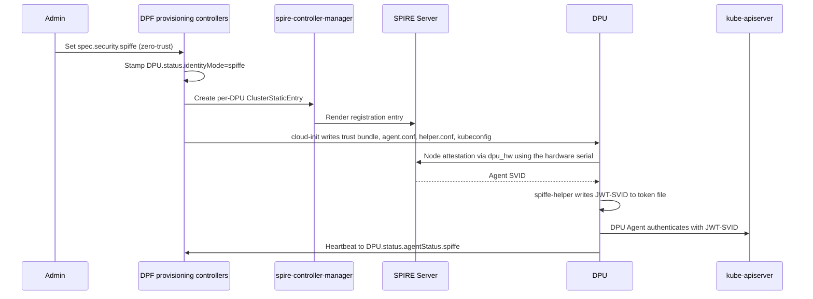

[[_TOC_]]

This guide explains how to run the DPU Agent with a SPIFFE identity, so it authenticates to the
management-cluster Kubernetes API server with a short-lived JWT-SVID instead of a kubeadm bootstrap
token.

# Overview

By default the DPU Agent joins the management cluster with a kubeadm bootstrap token and then uses a
client certificate. In SPIFFE mode, DPF instead relies on a pre-installed SPIRE deployment: each DPU
attests to the SPIRE Server using its hardware serial, receives an SVID, and the DPU Agent presents a
JWT-SVID to the API server.

The scope of this feature is **only** the DPU Agent's credential to the management-cluster API
server. It does not change BMC mTLS, the provisioning CA, or how DPU services authenticate.

SPIFFE identity is available in Zero Trust deployments only, and is opt-in through a single stanza on
the `DPFOperatorConfig`.



SPIRE attests twice. Node attestation proves the DPU itself to the SPIRE Server, using the hardware
serial through the `dpu_hw` NodeAttestor. Workload attestation then proves the calling process, each
time something on that DPU asks the Workload API for an SVID, by matching it against the selectors on
the DPU's registration entry. The DPU Agent's entry uses `unix:uid:0`; the Kubernetes workload
attestor is enabled separately, once the DPU has completed TLS bootstrap.

# Prerequisites

DPF does not install or manage the SPIRE control plane. The following must already exist and be
reachable from the management cluster before you enable SPIFFE. Each row maps to the
`spec.security.spiffe` field that must be pointed at it.

| You must provide | Field it maps to | Notes |
|------------------|------------------|-------|
| A running SPIRE Server | `spireServerAddress` | `host:port` form, for example `spire-server.spire-system.svc:8081`. See [Configuring SPIRE Server](https://spiffe.io/docs/latest/deploying/spire_server/). |
| The trust domain that SPIRE Server is configured with | `spireTrustDomain` | Must match the SPIRE Server's own `trust_domain`. It is embedded in every DPU Agent SPIFFE ID. See [SPIFFE trust domain](https://spiffe.io/docs/latest/spiffe-about/spiffe-concepts/#trust-domain). |
| A SPIRE OIDC Discovery Provider | `spireOIDCURL` | Issuer URL the API server fetches signing keys from. See [OIDC Discovery Provider](https://github.com/spiffe/spire/tree/main/support/oidc-discovery-provider). |
| `spire-controller-manager` with the `ClusterStaticEntry` CRD (`spire.spiffe.io/v1alpha1`) | `spireControllerManagerClassName` | The class name must match the controller-manager instance that should render DPF's entries. See [spire-controller-manager](https://github.com/spiffe/spire-controller-manager). |
| A ConfigMap holding the SPIRE trust bundle | `trustBundle.name`, `trustBundle.namespace`, `trustBundle.format` | `name` and `namespace` are required. `format` selects the ConfigMap key and the SPIRE Agent parser: `pem` (the default) reads `data["bundle.pem"]`, `spiffe` reads `data["bundle.spiffe"]`. DPF reads this bundle and writes it onto each DPU. |
| kube-apiserver `AuthenticationConfiguration` trusting the SPIRE issuer | `spireOIDCURL`, `kubeAPIAudience` | `jwt[].issuer` must equal `spireOIDCURL`, and `audiences[]` must contain `kubeAPIAudience`. See [Structured Authentication Configuration](https://kubernetes.io/docs/reference/access-authn-authz/authentication/#using-authentication-configuration). |
| The `dpu_hw` NodeAttestor plugin on the SPIRE Server | (none) | Required for DPUs to attest, so it must be installed before any DPU is provisioned in SPIFFE mode. Delivered out-of-band; contact your NVIDIA representative for the plugin and its deployment overlay. |

> [!NOTE]
> DPF packages `spire-agent` 1.15.0 and `spiffe-helper` 0.11.0 onto the DPU. These are the DPU-side
> versions only; DPF does not pin a SPIRE Server version. Your SPIRE Server must be
> version-compatible with a 1.15.0 agent per the upstream SPIRE compatibility policy.

# Enabling SPIFFE

Add the `spiffe` stanza under `spec.security` of the `DPFOperatorConfig`. All six fields are required.

```yaml
apiVersion: operator.dpu.nvidia.com/v1alpha1
kind: DPFOperatorConfig
metadata:
  name: dpfoperatorconfig
  namespace: dpf-operator-system
spec:
  deploymentMode: zero-trust
  security:
    spiffe:
      spireServerAddress: spire-server.spire-system.svc:8081
      spireTrustDomain: cs.internal
      kubeAPIAudience: https://kubernetes.default.svc
      spireOIDCURL: https://spire-oidc.spire-system.svc
      spireControllerManagerClassName: spire-mgmt-spire
      trustBundle:
        name: spire-bundle
        namespace: spire-system
        format: pem
```

The API server enforces the field formats, and rejects the stanza entirely unless
`spec.deploymentMode` is `zero-trust`.

For the full field reference see
[DPFOperatorConfig](../developer-guides/api/dpfoperatorconfig.md) and the generated
[API reference](../developer-guides/api/api.md).

## Which DPUs are affected

`DPU.status.identityMode` records the mechanism a DPU uses. It is stamped exactly once, during the
`Initializing` phase, and is immutable afterwards.

| `status.identityMode` | Meaning |
|-----------------------|---------|
| `spiffe` | The DPU Agent authenticates with a SPIRE-issued JWT-SVID. |
| `bootstrap-token` | The DPU Agent authenticates with a kubeadm bootstrap token. |
| unset | Legacy DPU provisioned before SPIFFE existed. Treated as `bootstrap-token`. |

Because the stamp happens at initialization, enabling SPIFFE affects **newly provisioned DPUs only**.
DPUs already running in bootstrap-token mode continue to work unchanged, and a cluster can hold a mix
of both.

## Disabling SPIFFE

The `spiffe` stanza cannot be removed from a live `DPFOperatorConfig`; the API server rejects the
update, because SPIFFE-mode DPUs depend on it.

If you must return the cluster to bootstrap-token identity, delete and recreate the
`DPFOperatorConfig` without the stanza. This is a disruptive escape hatch: every existing
SPIFFE-mode DPU must then be re-provisioned, because its stamped `identityMode` cannot change.

# Changing the configuration after DPUs exist

Edits to `spec.security.spiffe` are accepted after bootstrap, but most fields are written into a DPU's
cloud-init at provisioning time and never rewritten, so an edit usually reaches new DPUs only.

| Field | Effect of changing it |
|-------|-----------------------|
| `spireTrustDomain` | Breaks every existing SPIFFE-mode DPU. DPF patches their entries into the new trust domain, but their on-disk `agent.conf` and RoleBinding subject still carry the old one, so they attest under a trust domain with no matching entry. Re-provision them all. |
| `spireServerAddress`, `kubeAPIAudience`, `trustBundle` | New DPUs only; existing DPUs keep the values baked in when they were provisioned. The kube-apiserver must keep accepting the old `kubeAPIAudience` until they are re-provisioned. Rolling the trust bundle needs no re-provision, since SPIRE refreshes it from the server once the agent has attested. |
| `spireControllerManagerClassName` | Safe. Existing entries are patched in place to the new class, and nothing on the DPU refers to it. |
| `spireOIDCURL` | Not read by DPF, but it must still match the issuer in the kube-apiserver `AuthenticationConfiguration`; changing one without the other breaks authentication for every SPIFFE-mode DPU. |

# What DPF creates

## SPIFFE identifiers

For a DPU with serial `<serial>` and trust domain `<trustDomain>`:

* Workload ID (the DPU Agent): `spiffe://<trustDomain>/dpu/<serial>/process/dpu-agent`
* Agent ID (the SPIRE agent on the DPU): `spiffe://<trustDomain>/spire/agent/dpu_hw/<serial>`

The serial comes from `DPUDevice.spec.serialNumber`, which is immutable, and is lowercased into the
identity. It must be at most 64 characters and use only RFC 3986 unreserved characters (`a-z`, `0-9`,
`-`, `.`, `_`, `~`).

## ClusterStaticEntry

DPF creates one `ClusterStaticEntry` per SPIFFE-mode DPU, named `dpu-agent-<serial>`, and deletes it
when the `DPUDevice` is removed. A finalizer,
`provisioning.dpu.nvidia.com/spiffe-deregistration`, holds the `DPUDevice` until the entry is gone,
so a reflashed DPU cannot race a stale identity.

The entry is created with these values:

| Field | Value |
|-------|-------|
| `spec.spiffeID` | The workload ID above |
| `spec.parentID` | The agent ID above |
| `spec.selectors` | `unix:uid:0` |
| `spec.x509SVIDTTL` | 1 hour |
| `spec.jwtSVIDTTL` | 2 minutes |
| `spec.hint` | `dpu-agent` |
| `spec.className` | Your `spireControllerManagerClassName` |

DPF owns this spec. Out-of-band edits are reverted on the next reconcile and reported as an event.

## RBAC

In SPIFFE mode the per-DPU `RoleBinding` subject is the literal SPIFFE ID URI instead of the
certificate username used for bootstrap-token DPUs. The bound `Role` is otherwise identical, so the
DPU Agent's permissions do not change with identity mode.

Because the subject is that URI, the username the kube-apiserver derives from the JWT `sub` claim must
equal it exactly. In the `AuthenticationConfiguration`, `claimMappings.username` must therefore yield
the bare SPIFFE ID, with no added prefix.

## The spire-agent-rbac component

Enabling SPIFFE also deploys a system `DPUService` named `spire-agent-rbac` to the DPU cluster. It
contains no workload, and creates only a `ClusterRole` and `ClusterRoleBinding` named
`dpf-spire-kubelet-pods`, granting `get` on `nodes/pods` to the `system:nodes` group. The SPIRE agent
runs on the DPU host OS rather than as a pod, so it has no ServiceAccount and authenticates with the
kubelet client certificate; this grant is what its Kubernetes workload attestor needs. There is
nothing to configure.

## On the DPU

cloud-init installs `spire-agent`, `spiffe-helper` and the `dpu-hw-agent` NodeAttestor plugin, and
orders the DPU Agent to start after both. It writes:

| Path | Contents |
|------|----------|
| `/etc/spire/agent/agent.conf` | SPIRE agent configuration (server address, trust domain, `dpu_hw` attestor) |
| `/etc/spire/agent/trust-bundle.pem` | Trust bundle, when `trustBundle.format` is `pem` |
| `/etc/spire/agent/trust-bundle.spiffe` | Trust bundle, when `trustBundle.format` is `spiffe` |
| `/etc/spire/agent/k8s-workload-attestor.conf` | Kubernetes workload attestor configuration |
| `/etc/systemd/system/spire-agent.service.d/k8s-workload-attestor.conf` | systemd drop-in for the Kubernetes workload attestor |
| `/etc/spiffe-helper/helper.conf` | spiffe-helper configuration |
| `/run/spire/agent.sock` | SPIRE agent Workload API socket |
| `/opt/dpf/spire/plugins/dpu-hw-agent` | The `dpu_hw` NodeAttestor agent plugin |
| `/var/lib/dpf/dpuagent/spiffe/token` | JWT-SVID written by spiffe-helper and read by the DPU Agent |
| `/var/lib/dpf/dpuagent/kubeconfig` | Kubeconfig referencing the token file |

# Verification

Check which identity mode each DPU was stamped with:

```bash
kubectl -n dpf-operator-system get dpu -o jsonpath='
{range .items[*]}
{.metadata.name}{"\t"}
{.status.identityMode}
{"\n"}
{end}'
```

Check that each DPU's registration entry has been rendered by `spire-controller-manager`:

```bash
kubectl -n dpf-operator-system get dpudevice -o jsonpath='
{range .items[*]}
{.metadata.name}{"\t"}
{range .status.conditions[?(@.type=="SPIFFEEntryReady")]}{.status}{"/"}{.reason}{"\t"}{.message}{end}
{"\n"}
{end}'
```

Check that the DPU Agent is reporting its SPIFFE heartbeat, and whether it has enabled the Kubernetes
workload attestor:

```bash
kubectl -n dpf-operator-system get dpu -o jsonpath='
{range .items[*]}
{.metadata.name}{"\t"}
{.status.agentStatus.spiffe.lastProbeTime}{"\t"}
{.status.agentStatus.spiffe.lastProbeMessage}{"\t"}
{range .status.agentStatus.conditions[?(@.type=="SPIREWorkloadAttestorEnabled")]}{.status}{"/"}{.reason}{end}
{"\n"}
{end}'
```

List the entries DPF created:

```bash
kubectl get clusterstaticentries -l provisioning.dpu.nvidia.com/dpudevice-name
```

A healthy SPIFFE-mode DPU shows `identityMode: spiffe`, `SPIFFEEntryReady=True/Success`,
`SPIREWorkloadAttestorEnabled=True`, and a `lastProbeTime` that advances (the DPU Agent probes every
30 seconds).

# Troubleshooting

## SPIFFEEntryReady condition

The condition mirrors the upstream `ClusterStaticEntry` status onto the `DPUDevice`. Because the
reason values are generic, use the message to distinguish cases.

| Status | Reason | Message | Meaning and action |
|--------|--------|---------|--------------------|
| `True` | `Success` | — | The entry is rendered. No action needed. |
| `False` | `Pending` | `Awaiting spire-controller-manager to observe ClusterStaticEntry` | The entry exists but the controller-manager has not picked it up. Check that `spireControllerManagerClassName` matches a running instance. |
| `False` | `Pending` | `ClusterStaticEntry set; rendering pending` | The controller-manager accepted the entry but has not rendered it to the SPIRE Server yet. Check controller-manager logs and SPIRE Server reachability. |
| `False` | `Error` | `serial ... is not a valid DNS-1123 subdomain` or `serial contains invalid character` | Terminal. The DPU serial cannot form a valid identity. The `DPUDevice` must be deleted and recreated with a serial inside the supported charset and length. |
| `False` | `Error` | `failed to apply ClusterStaticEntry ...` | Transient. Usually the `ClusterStaticEntry` CRD is not installed or the operator lacks RBAC for `spire.spiffe.io`. DPF retries automatically. |
| `False` | `Error` | `ClusterStaticEntry is masked by another entry` | Another entry in SPIRE shadows DPF's. Find and remove the conflicting entry. |
| `False` | `Error` | `ClusterStaticEntry status has invalid field types` | The status written by `spire-controller-manager` is malformed. Check that its version is compatible with the `spire.spiffe.io/v1alpha1` CRD installed in the cluster. |

If the condition is absent entirely, the `DPUDevice` has no SPIFFE-mode `DPU` bound to it. That is
expected for bootstrap-token DPUs and for devices that have not been attached yet.

## SPIREWorkloadAttestorEnabled condition

The DPU Agent reports this on `status.agentStatus.conditions` of the `DPU`, retrying once a minute
until the Kubernetes workload attestor is enabled. Enabling it restarts `spire-agent.service` once,
which does not disturb the DPU Agent's existing token.

| Status | Reason | Meaning and action |
|--------|--------|--------------------|
| `True` | `SPIREWorkloadAttestorEnabled` | The attestor is configured. No action needed. |
| `False` | `WaitingForKubeletCertificates` | Expected for a while after boot. If it persists, the DPU has not completed kubelet TLS bootstrap. |
| `False` | `EnableFailed` | The configuration merge, its validation, or the agent restart failed. A message of `marker not found in SPIRE agent configuration` means `/etc/spire/agent/agent.conf` was edited by hand. |

## Events

DPF emits events on the `DPUDevice`:

```bash
kubectl -n dpf-operator-system get events --field-selector involvedObject.name=$DPUDEVICE_NAME
```

| Reason | Type | Meaning |
|--------|------|---------|
| `SPIFFEEntryRegistered` | Normal | The `ClusterStaticEntry` was created. |
| `SPIFFEEntryRegistrationFailed` | Warning | The entry could not be created or updated. |
| `SPIFFEEntryMasked` | Warning | Another entry shadows DPF's entry. |
| `SPIFFEEntryDeleteRequested` | Normal | DPF issued a delete during deprovisioning. |
| `SPIFFEEntrySpecDriftReconciled` | Warning | An out-of-band edit to the entry spec was reverted. |
| `SPIFFEDuplicateDPU` | Warning | More than one SPIFFE-mode DPU is bound to a single `DPUDevice`. Remove the stale `DPU` object. |

## The DPU Agent is not reaching the API server

If `SPIFFEEntryReady=True` but `status.agentStatus.spiffe.lastProbeTime` is stale or absent, the
registration is healthy and the problem is on the DPU or at the API server. Check, in order:

1. `spire-agent` attested successfully. Attestation fails if the `dpu_hw` NodeAttestor plugin is
   missing on the SPIRE Server, or if the DPU's hardware serial is unreadable.
2. `spiffe-helper` wrote `/var/lib/dpf/dpuagent/spiffe/token`. The DPU Agent waits for this file.
3. The API server accepts the JWT. The `AuthenticationConfiguration` issuer must equal
   `spireOIDCURL` and its audiences must contain `kubeAPIAudience`; a mismatch produces
   authentication failures with a valid token.
4. The username the API server derives from the token matches the `RoleBinding` subject. When it does
   not, the DPU Agent authenticates successfully and is then denied with 403 on every request.

## A DPU was deleted but its identity remains

Deletion is ordered by the `provisioning.dpu.nvidia.com/spiffe-deregistration` finalizer, so a
`DPUDevice` stuck in `Terminating` usually means the `ClusterStaticEntry` could not be deleted.
Check whether something added a finalizer to the entry:

```bash
kubectl get clusterstaticentry dpu-agent-$SERIAL -o jsonpath='{.metadata.finalizers}{"\n"}'
```

# Limitations

* The workload selector is a coarse `unix:uid:0`. Any root process on the DPU can obtain the DPU
  Agent SVID, though `spec.parentID` confines that to the one DPU the entry was created for.
* Node attestation evidence is currently transmitted in plaintext; the serial is not
  cryptographically bound to the hardware.
* Trust domain federation is not supported. DPF never sets `federatesWith` on the entries it creates.
* SPIFFE cannot be turned off in place. See [Disabling SPIFFE](#disabling-spiffe).

# Related topics

* [Zero Trust Advanced Configuration](zero-trust-advanced-configuration.md)
* [Provisioning CA Certificate Rotation](ca-certificate-rotation.md)
* [Generated API reference](../developer-guides/api/api.md) - `DPFOperatorConfig.spec.security.spiffe`, `DPU.status.identityMode` and `DPU.status.agentStatus.spiffe` field definitions
