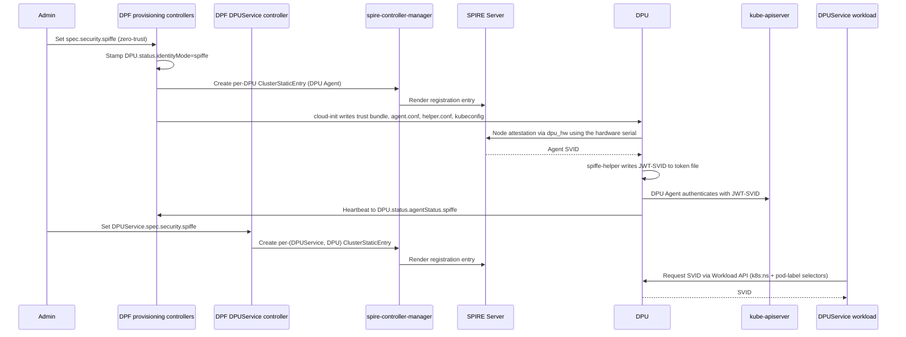
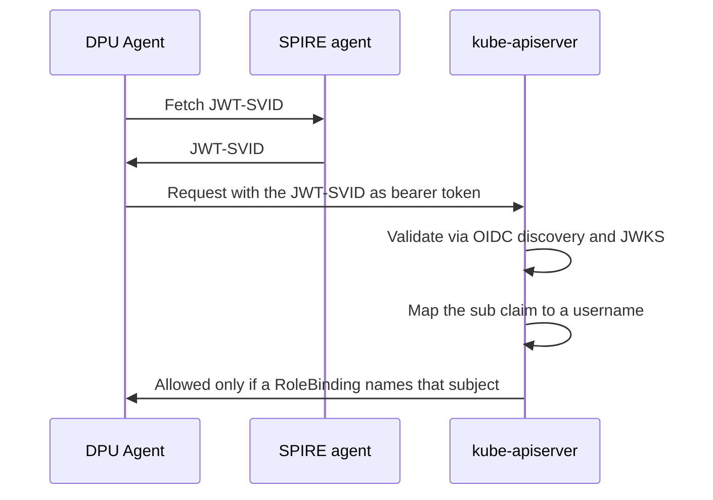
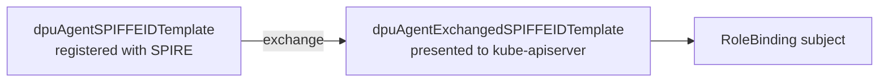

[[_TOC_]]

This guide explains how to give DPUs and the services running on them SPIFFE identities issued by
a pre-installed SPIRE deployment, instead of relying on bootstrap tokens or shared secrets. DPF
registers two kinds of identity this way:

* the **DPU Agent**'s credential to the management-cluster Kubernetes API server, which it presents
  as a short-lived JWT-SVID instead of a kubeadm bootstrap token
* a **DPUService**'s identity for workloads it runs on a DPU, which the workload itself consumes to
  prove what it is to other services

# Overview

By default the DPU Agent joins the management cluster with a kubeadm bootstrap token and then uses a
client certificate, and DPUServices have no cryptographic identity at all. In SPIFFE mode, DPF
instead relies on a pre-installed SPIRE deployment: each DPU attests to the SPIRE Server using its
hardware serial, and the DPU Agent and any opted-in DPUServices then receive their own SVIDs from
the SPIRE agent running on that DPU.

The scope of this feature is the DPU Agent's credential to the management-cluster API server, and
per-DPUService identities on the DPU cluster. It does not change BMC mTLS or the provisioning CA.

SPIFFE identity is available in Zero Trust deployments only, and is opt-in through a single stanza on
the `DPFOperatorConfig`, plus a per-DPUService opt-in for workload identities.



SPIRE attests twice. Node attestation proves the DPU itself to the SPIRE Server, using the hardware
serial through the `dpu_hw` NodeAttestor. Workload attestation then proves the calling process, each
time something on that DPU asks the Workload API for an SVID, by matching it against the selectors on
a registration entry. The DPU Agent's entry uses `unix:uid:0`; a DPUService's entry uses narrower
Kubernetes-workload selectors (see [What gets an identity](#what-gets-an-identity) below), because
both share the same parent SPIRE agent and a coarse selector would let any root process on the DPU
claim either identity. The Kubernetes workload attestor is enabled separately, once the DPU has
completed TLS bootstrap.

## What gets an identity

Both identities are parented to the same per-DPU SPIRE agent, but opt in, are named, and are
reported on separately:

|                  | DPU Agent                                      | DPUService                                                                   |
|------------------|-------------------------------------------------|------------------------------------------------------------------------------|
| Opt-in           | `DPU.status.identityMode: spiffe`               | `DPUService.spec.security.spiffe`                                            |
| Default ID       | `spiffe://<td>/dpu/<serial>/process/dpu-agent`  | `spiffe://<td>/dpu/<serial>/service/<namespace>/<serviceID>`                 |
| Selectors        | `unix:uid:0`                                    | `k8s:ns:<namespace>`, `k8s:pod-label:svc.dpu.nvidia.com/service:<serviceID>` |
| Status condition | `SPIFFEEntryReady` on `DPUDevice`               | `SPIFFEEntriesReady` on `DPUService`                                         |

One `ClusterStaticEntry` is created per *(DPUService, DPU)* pair, because an entry carries a single
parent. A DPUService targeting ten DPUs therefore has ten entries. A DPUService's entries are also
rendered live on every reconcile from the current `DPFOperatorConfig`, unlike the DPU Agent's, which
are written into cloud-init once at provisioning time; see
[Changing the configuration after DPUs exist](#changing-the-configuration-after-dpus-exist).

# Prerequisites

DPF does not install or manage the SPIRE control plane. The following must already exist and be
reachable from the management cluster before you enable SPIFFE. Each row maps to the
`spec.security.spiffe` field that must be pointed at it, and applies to both the DPU Agent and
DPUService identities.

| You must provide | Field it maps to | Notes |
|------------------|------------------|-------|
| A running SPIRE Server | `spireServerAddress` | `host:port` form, for example `spire-server.spire-system.svc:8081`. See [Configuring SPIRE Server](https://spiffe.io/docs/latest/deploying/spire_server/). |
| The trust domain that SPIRE Server is configured with | `spireTrustDomain` | Must match the SPIRE Server's own `trust_domain`. It is embedded in every DPU Agent and DPUService SPIFFE ID. See [SPIFFE trust domain](https://spiffe.io/docs/latest/spiffe-about/spiffe-concepts/#trust-domain). |
| A SPIRE OIDC Discovery Provider | `spireOIDCURL` | Issuer URL the API server fetches signing keys from. See [OIDC Discovery Provider](https://github.com/spiffe/spire/tree/main/support/oidc-discovery-provider). |
| `spire-controller-manager` with the `ClusterStaticEntry` CRD (`spire.spiffe.io/v1alpha1`) | `spireControllerManagerClassName` | The class name must match the controller-manager instance that should render DPF's entries. See [spire-controller-manager](https://github.com/spiffe/spire-controller-manager). |
| A ConfigMap holding the SPIRE trust bundle | `trustBundle.name`, `trustBundle.namespace`, `trustBundle.format` | `name` and `namespace` are required. `format` selects the ConfigMap key and the SPIRE Agent parser: `pem` (the default) reads `data["bundle.pem"]`, `spiffe` reads `data["bundle.spiffe"]`. DPF reads this bundle and writes it onto each DPU. |
| kube-apiserver `AuthenticationConfiguration` trusting the SPIRE issuer | `spireOIDCURL`, `kubeAPIAudience` | `jwt[].issuer` must equal `spireOIDCURL`, and `audiences[]` must contain `kubeAPIAudience`. Only needed for the DPU Agent identity. See [Structured Authentication Configuration](https://kubernetes.io/docs/reference/access-authn-authz/authentication/#using-authentication-configuration). |
| The `dpu_hw` NodeAttestor plugin on the SPIRE Server | (none) | Required for DPUs to attest, so it must be installed before any DPU is provisioned in SPIFFE mode. Delivered out-of-band; contact your NVIDIA representative for the plugin and its deployment overlay. |

> [!NOTE]
> DPF packages `spire-agent` 1.15.0 and `spiffe-helper` 0.11.0 onto the DPU. These are the DPU-side
> versions only; DPF does not pin a SPIRE Server version. Your SPIRE Server must be
> version-compatible with a 1.15.0 agent per the upstream SPIRE compatibility policy.

# Enabling SPIFFE

Add the `spiffe` stanza under `spec.security` of the `DPFOperatorConfig`. All six fields are required.
This enables SPIFFE identity for the cluster and stamps newly provisioned DPUs into SPIFFE mode; it
does not by itself give any DPUService an identity.

```yaml
apiVersion: operator.dpu.nvidia.com/v1alpha1
kind: DPFOperatorConfig
metadata:
  name: dpfoperatorconfig
  namespace: dpf-operator-system
spec:
  deploymentMode: zero-trust
  security:
    spiffe:
      spireServerAddress: spire-server.spire-system.svc:8081
      spireTrustDomain: cs.internal
      kubeAPIAudience: https://kubernetes.default.svc
      spireOIDCURL: https://spire-oidc.spire-system.svc
      spireControllerManagerClassName: spire-mgmt-spire
      trustBundle:
        name: spire-bundle
        namespace: spire-system
        format: pem
```

The API server enforces the field formats, and rejects the stanza entirely unless
`spec.deploymentMode` is `zero-trust`.

For the full field reference see
[DPFOperatorConfig](../developer-guides/api/dpfoperatorconfig.md) and the generated
[API reference](../developer-guides/api/api.md).

## Opting a DPUService in

A DPUService gets its own identity by setting `spec.security.spiffe`. The field is presence-gated and
has no sub-fields:

```yaml
spec:
  security:
    spiffe: {}
```

It can also be set on a `DPUServiceTemplate`, in which case the DPUDeployment controller propagates it
to the DPUServices it generates. It must not be set on a DPUService with `spec.deployInCluster: true`,
which runs on the host and has no per-DPU SPIRE agent to parent to; admission rejects that
combination.

## Customizing the identity layout

Deployments that follow their own naming scheme can override the rendered SPIFFE IDs with Go
templates, one pair per identity:

| Field                                  | Renders                                                  |
|-----------------------------------------|-----------------------------------------------------------|
| `dpuAgentSPIFFEIDTemplate`              | the DPU Agent identity registered with SPIRE               |
| `dpuAgentExchangedSPIFFEIDTemplate`     | the DPU Agent subject after an external token exchange     |
| `dpuServiceSPIFFEIDTemplate`            | the DPUService identity registered with SPIRE              |
| `dpuServiceExchangedSPIFFEIDTemplate`   | the DPUService subject after an external token exchange    |

```yaml
spec:
  security:
    spiffe:
      dpuServiceSPIFFEIDTemplate: >-
        spiffe://{{ .TrustDomain }}/tenant/{{ index .DPUServiceMeta.Labels "tenant" }}/dpu/{{ .SerialNumber }}/service/{{ .Namespace }}/{{ .ServiceID }}
```

Templates are validated when the configuration is applied, not per DPU or per DPUService. A DPU Agent
template that does not depend on the DPU serial is rejected, and a DPUService template that does not
depend on all of the DPU serial, the namespace and the service ID is rejected: it would hand a single
identity to workloads that are meant to be distinct.

DPF never presents a DPUService's exchanged subject anywhere itself, unlike the DPU Agent's, which it
uses to build a `RoleBinding` (see [How the DPU Agent authenticates](#how-the-dpu-agent-authenticates)).
`dpuServiceExchangedSPIFFEIDTemplate` still has to render and validate, so that the whole identity
layout is declared and checked in one place even though only the workload that receives the SVID
reads it.

## Which DPUs are affected

`DPU.status.identityMode` records the mechanism a DPU uses. It is stamped exactly once, during the
`Initializing` phase, and is immutable afterwards.

| `status.identityMode` | Meaning |
|-----------------------|---------|
| `spiffe` | The DPU Agent authenticates with a SPIRE-issued JWT-SVID. |
| `bootstrap-token` | The DPU Agent authenticates with a kubeadm bootstrap token. |
| unset | Legacy DPU provisioned before SPIFFE existed. Treated as `bootstrap-token`. |

Because the stamp happens at initialization, enabling SPIFFE affects **newly provisioned DPUs only**.
DPUs already running in bootstrap-token mode continue to work unchanged, and a cluster can hold a mix
of both; DPF skips bootstrap-token DPUs when registering DPUService identities, so a DPUService opting
in during such a migration only gets entries on the DPUs that have already moved to SPIFFE.

## Disabling SPIFFE

The `spiffe` stanza cannot be removed from a live `DPFOperatorConfig`; the API server rejects the
update, because SPIFFE-mode DPUs depend on it.

If you must return the cluster to bootstrap-token identity, delete and recreate the
`DPFOperatorConfig` without the stanza. This is a disruptive escape hatch: every existing
SPIFFE-mode DPU must then be re-provisioned, because its stamped `identityMode` cannot change.

# Changing the configuration after DPUs exist

Edits to `spec.security.spiffe` are accepted after bootstrap, but most fields are written into a DPU's
cloud-init at provisioning time and never rewritten, so an edit usually reaches new DPUs only. DPUService
entries are the exception: the DPUService controller re-renders them from the current configuration on
every reconcile, so they follow an edit immediately.

| Field | Effect of changing it |
|-------|-----------------------|
| `spireTrustDomain` | Breaks every existing SPIFFE-mode DPU Agent. DPF patches DPU Agent entries into the new trust domain, but the on-disk `agent.conf` and RoleBinding subject still carry the old one, so the DPU Agent attests under a trust domain with no matching entry; re-provision affected DPUs. DPUService entries re-render into the new trust domain on the next reconcile with no DPU-side action needed. |
| `spireServerAddress`, `kubeAPIAudience`, `trustBundle` | New DPUs only for the DPU Agent; existing DPU Agents keep the values baked in when they were provisioned, and the kube-apiserver must keep accepting the old `kubeAPIAudience` until they are re-provisioned. Rolling the trust bundle needs no re-provision, since SPIRE refreshes it from the server once the agent has attested. Does not affect DPUService entries. |
| `spireControllerManagerClassName` | Safe. Existing entries of both kinds are patched in place to the new class, and nothing on the DPU refers to it. |
| `spireOIDCURL` | Not read by DPF, but it must still match the issuer in the kube-apiserver `AuthenticationConfiguration`; changing one without the other breaks authentication for every SPIFFE-mode DPU Agent. Does not affect DPUService entries. |
| `dpuAgentSPIFFEIDTemplate`, `dpuAgentExchangedSPIFFEIDTemplate` | New DPUs only; baked into cloud-init at provisioning time. |
| `dpuServiceSPIFFEIDTemplate`, `dpuServiceExchangedSPIFFEIDTemplate` | Re-rendered for every opted-in DPUService on the next reconcile. |

# What DPF creates

## SPIFFE identifiers

The default workload IDs are listed under [What gets an identity](#what-gets-an-identity) above; see
[Customizing the identity layout](#customizing-the-identity-layout) to override them. Both share one
parent per DPU, the identity of the SPIRE agent running on it:

* Agent ID: `spiffe://<trustDomain>/spire/agent/dpu_hw/<serial>`

The DPU serial comes from `DPUDevice.spec.serialNumber`, which is immutable, and is lowercased into
the identity. It must be at most 64 characters and use only RFC 3986 unreserved characters (`a-z`,
`0-9`, `-`, `.`, `_`, `~`). The DPUService namespace and service ID are normalized and constrained the
same way.

## ClusterStaticEntry

`ClusterStaticEntry` is used rather than `ClusterSPIFFEID`, which would otherwise generate entries
automatically from pods: `spire-controller-manager` only watches the cluster it runs in and identifies
nodes by their Kubernetes identity, but these workloads run in a DPUCluster and DPUs are identified by
hardware serial through the `dpu_hw` attestor. DPF therefore writes each entry explicitly.

DPF creates one `ClusterStaticEntry` per SPIFFE-mode DPU for the DPU Agent, named
`dpu-agent-<serial>`, and one per *(DPUService, DPU)* pair for each opted-in DPUService, named
`dpu-service-<namespace>-<dpuServiceName>-<serial>-<digest>`. Both are deleted when their owning
object is removed: a finalizer, `provisioning.dpu.nvidia.com/spiffe-deregistration`, holds the
`DPUDevice` until its DPU Agent entry is gone, and `dpu.nvidia.com/dpuservice-spiffe-deregistration`
holds the `DPUService` until all of its entries are gone. This ordering means a reflashed DPU or a
deleted DPUService cannot race a stale identity.

`spec.spiffeID`, `spec.parentID` and `spec.selectors` are the workload ID, agent ID and selectors
given under [What gets an identity](#what-gets-an-identity) and [SPIFFE identifiers](#spiffe-identifiers)
above. The remaining fields are the same for both entry kinds:

| Field | Value |
|-------|-------|
| `spec.x509SVIDTTL` | 1 hour |
| `spec.jwtSVIDTTL` | 2 minutes |
| `spec.hint` | `dpu-agent` for the DPU Agent entry, `dpu-service` for a DPUService entry |
| `spec.className` | Your `spireControllerManagerClassName` |

DPF owns both specs. Out-of-band edits are reverted on the next reconcile and reported as an event.

## RBAC

In SPIFFE mode the per-DPU `RoleBinding` subject for the DPU Agent is the literal SPIFFE ID URI
instead of the certificate username used for bootstrap-token DPUs. The bound `Role` is otherwise
identical, so the DPU Agent's permissions do not change with identity mode.

Because the subject is that URI, the username the kube-apiserver derives from the JWT `sub` claim must
equal it exactly. In the `AuthenticationConfiguration`, `claimMappings.username` must therefore yield
the bare SPIFFE ID, with no added prefix.

A DPUService identity is not used to authenticate to any Kubernetes API server; it is consumed by
whatever the workload itself talks to, so DPF creates no RBAC object for it.

## The spire-agent-rbac component

Enabling SPIFFE also deploys a system `DPUService` named `spire-agent-rbac` to the DPU cluster. It
contains no workload, and creates only a `ClusterRole` and `ClusterRoleBinding` named
`dpf-spire-kubelet-pods`, granting `get` on `nodes/pods` to the `system:nodes` group. The SPIRE agent
runs on the DPU host OS rather than as a pod, so it has no ServiceAccount and authenticates with the
kubelet client certificate; this grant is what its Kubernetes workload attestor needs. There is
nothing to configure.

## On the DPU

cloud-init installs `spire-agent`, `spiffe-helper` and the `dpu-hw-agent` NodeAttestor plugin, and
orders the DPU Agent to start after both. It writes:

| Path | Contents |
|------|----------|
| `/etc/spire/agent/agent.conf` | SPIRE agent configuration (server address, trust domain, `dpu_hw` attestor) |
| `/etc/spire/agent/trust-bundle.pem` | Trust bundle, when `trustBundle.format` is `pem` |
| `/etc/spire/agent/trust-bundle.spiffe` | Trust bundle, when `trustBundle.format` is `spiffe` |
| `/etc/spire/agent/k8s-workload-attestor.conf` | Kubernetes workload attestor configuration |
| `/etc/systemd/system/spire-agent.service.d/k8s-workload-attestor.conf` | systemd drop-in for the Kubernetes workload attestor |
| `/etc/spiffe-helper/helper.conf` | spiffe-helper configuration |
| `/run/spire/agent.sock` | SPIRE agent Workload API socket |
| `/opt/dpf/spire/plugins/dpu-hw-agent` | The `dpu_hw` NodeAttestor agent plugin |
| `/var/lib/dpf/dpuagent/spiffe/token` | JWT-SVID written by spiffe-helper and read by the DPU Agent |
| `/var/lib/dpf/dpuagent/kubeconfig` | Kubeconfig referencing the token file |

A DPUService workload fetches its own SVID directly from `/run/spire/agent.sock` using the Workload
API; DPF writes nothing extra to the DPU for it.

# How the DPU Agent authenticates

This is the one flow where an identity is consumed by DPF itself, and it is worth understanding
because it involves the Kubernetes API server. A DPUService's identity has no equivalent flow: DPF
issues it but never presents it anywhere.

The DPU Agent needs to write its own `DPU` status in the host cluster. In SPIFFE mode it presents a
[JWT-SVID](https://spiffe.io/docs/latest/spiffe-about/spiffe-concepts/#jwt-svid) instead of a
bootstrap token, and the API server validates it as an OIDC token.



A mismatch anywhere in this chain, the OIDC issuer/audience or the `RoleBinding` subject described
under [RBAC](#rbac), lets the DPU Agent authenticate but leaves it unauthorized, reporting
`403 ... cannot get resource "dpus"`; see
[The DPU Agent is not reaching the API server](#the-dpu-agent-is-not-reaching-the-api-server).

## Token exchange

Some environments exchange the JWT-SVID for a token from a different issuer before it reaches the
API server. In that case the subject the API server sees is not the one registered with SPIRE, so
DPF has to be told both: it registers `dpuAgentSPIFFEIDTemplate` with SPIRE and builds the
`RoleBinding` from `dpuAgentExchangedSPIFFEIDTemplate`.



The exchange service is expected to implement
[RFC 8693](https://datatracker.ietf.org/doc/html/rfc8693) token exchange, and the API server has to
trust the exchanged token's issuer in addition to the SPIRE one. Where the exchange happens and how it
is configured is deployment-specific and outside the scope of this page;
`dpuAgentExchangedSPIFFEIDTemplate` only tells DPF what subject to expect, so that the `RoleBinding` it
creates matches what the API server sees.

# Verification

Check which identity mode each DPU was stamped with:

```bash
kubectl -n dpf-operator-system get dpu -o jsonpath='
{range .items[*]}
{.metadata.name}{"\t"}
{.status.identityMode}
{"\n"}
{end}'
```

Check that each DPU's DPU Agent registration entry has been rendered by `spire-controller-manager`:

```bash
kubectl -n dpf-operator-system get dpudevice -o jsonpath='
{range .items[*]}
{.metadata.name}{"\t"}
{range .status.conditions[?(@.type=="SPIFFEEntryReady")]}{.status}{"/"}{.reason}{"\t"}{.message}{end}
{"\n"}
{end}'
```

Check the same for a DPUService's entries:

```bash
kubectl -n dpf-operator-system get dpuservice <name> \
  -o jsonpath='{.status.conditions[?(@.type=="SPIFFEEntriesReady")]}'
```

`SPIFFEEntriesReady` is `True` with no entries when a DPUService does not use SPIFFE, so it never
holds back the readiness of services that do not opt in.

Check that the DPU Agent is reporting its SPIFFE heartbeat, and whether it has enabled the Kubernetes
workload attestor:

```bash
kubectl -n dpf-operator-system get dpu -o jsonpath='
{range .items[*]}
{.metadata.name}{"\t"}
{.status.agentStatus.spiffe.lastProbeTime}{"\t"}
{.status.agentStatus.spiffe.lastProbeMessage}{"\t"}
{range .status.agentStatus.conditions[?(@.type=="SPIREWorkloadAttestorEnabled")]}{.status}{"/"}{.reason}{end}
{"\n"}
{end}'
```

List the entries DPF created, of either kind:

```bash
kubectl get clusterstaticentries -l provisioning.dpu.nvidia.com/dpudevice-name
kubectl get clusterstaticentries -l dpu.nvidia.com/dpuservice-name
```

A healthy SPIFFE-mode DPU shows `identityMode: spiffe`, `SPIFFEEntryReady=True/Success`,
`SPIREWorkloadAttestorEnabled=True`, and a `lastProbeTime` that advances (the DPU Agent probes every
30 seconds). A healthy opted-in DPUService shows `SPIFFEEntriesReady=True`.

# Troubleshooting

## SPIFFEEntryReady condition (DPU Agent)

The condition mirrors the upstream `ClusterStaticEntry` status onto the `DPUDevice`. Because the
reason values are generic, use the message to distinguish cases.

| Status | Reason | Message | Meaning and action |
|--------|--------|---------|--------------------|
| `True` | `Success` | — | The entry is rendered. No action needed. |
| `False` | `Pending` | `Awaiting spire-controller-manager to observe ClusterStaticEntry` | The entry exists but the controller-manager has not picked it up. Check that `spireControllerManagerClassName` matches a running instance. |
| `False` | `Pending` | `ClusterStaticEntry set; rendering pending` | The controller-manager accepted the entry but has not rendered it to the SPIRE Server yet. Check controller-manager logs and SPIRE Server reachability. |
| `False` | `Error` | `serial ... is not a valid DNS-1123 subdomain` or `serial contains invalid character` | Terminal. The DPU serial cannot form a valid identity. The `DPUDevice` must be deleted and recreated with a serial inside the supported charset and length. |
| `False` | `Error` | `failed to apply ClusterStaticEntry ...` | Transient. Usually the `ClusterStaticEntry` CRD is not installed or the operator lacks RBAC for `spire.spiffe.io`. DPF retries automatically. |
| `False` | `Error` | `ClusterStaticEntry is masked by another entry` | Another entry in SPIRE shadows DPF's. Find and remove the conflicting entry. |
| `False` | `Error` | `ClusterStaticEntry status has invalid field types` | The status written by `spire-controller-manager` is malformed. Check that its version is compatible with the `spire.spiffe.io/v1alpha1` CRD installed in the cluster. |

If the condition is absent entirely, the `DPUDevice` has no SPIFFE-mode `DPU` bound to it. That is
expected for bootstrap-token DPUs and for devices that have not been attached yet.

## SPIFFEEntriesReady condition (DPUService)

| Status | Reason | Meaning and action |
|--------|--------|--------------------|
| `True` | — | No entries (SPIFFE not opted in), or every desired entry is rendered. No action needed. |
| `False` | `Pending` | Waiting for `spire-controller-manager` to render an entry, or the `ClusterStaticEntry` CRD is not installed yet. Resolves on its own once SPIRE catches up or is installed. |
| `False` | `AwaitingDeletion` | Entries left over from a DPU or DPUCluster the DPUService no longer targets are still being deleted. Resolves on its own. |
| `False` | `Failure` | A target DPU cannot form a valid identity for this DPUService (see the serial/namespace/service ID constraints above), or an entry is masked by another entry. Needs operator action; the condition message lists the affected entries or DPUs. |

## SPIREWorkloadAttestorEnabled condition

The DPU Agent reports this on `status.agentStatus.conditions` of the `DPU`, retrying once a minute
until the Kubernetes workload attestor is enabled. Enabling it restarts `spire-agent.service` once,
which does not disturb the DPU Agent's existing token. DPUService workloads on that DPU cannot obtain
an SVID until this condition is `True`.

| Status | Reason | Meaning and action |
|--------|--------|--------------------|
| `True` | `SPIREWorkloadAttestorEnabled` | The attestor is configured. No action needed. |
| `False` | `WaitingForKubeletCertificates` | Expected for a while after boot. If it persists, the DPU has not completed kubelet TLS bootstrap. |
| `False` | `EnableFailed` | The configuration merge, its validation, or the agent restart failed. A message of `marker not found in SPIRE agent configuration` means `/etc/spire/agent/agent.conf` was edited by hand. |

## Events

DPF emits events on the `DPUDevice` for the DPU Agent identity, and on the `DPUService` for its
workload identities:

```bash
kubectl -n dpf-operator-system get events --field-selector involvedObject.name=$DPUDEVICE_NAME
kubectl -n dpf-operator-system get events --field-selector involvedObject.name=$DPUSERVICE_NAME
```

| Reason | Type | Meaning |
|--------|------|---------|
| `SPIFFEEntryRegistered` | Normal | The DPU Agent's `ClusterStaticEntry` was created. |
| `SPIFFEEntryRegistrationFailed` | Warning | The DPU Agent's entry could not be created or updated. |
| `SPIFFEEntryMasked` | Warning | Another entry shadows the DPU Agent's entry. |
| `SPIFFEEntryDeleteRequested` | Normal | DPF issued a delete for the DPU Agent's entry during deprovisioning. |
| `SPIFFEEntrySpecDriftReconciled` | Warning | An out-of-band edit to an entry spec was reverted. |
| `SPIFFEDuplicateDPU` | Warning | More than one SPIFFE-mode DPU is bound to a single `DPUDevice`. Remove the stale `DPU` object. |

## The DPU Agent is not reaching the API server

If `SPIFFEEntryReady=True` but `status.agentStatus.spiffe.lastProbeTime` is stale or absent, the
registration is healthy and the problem is on the DPU or at the API server. Check, in order:

1. `spire-agent` attested successfully. Attestation fails if the `dpu_hw` NodeAttestor plugin is
   missing on the SPIRE Server, or if the DPU's hardware serial is unreadable.
2. `spiffe-helper` wrote `/var/lib/dpf/dpuagent/spiffe/token`. The DPU Agent waits for this file.
3. The API server accepts the JWT. The `AuthenticationConfiguration` issuer must equal
   `spireOIDCURL` and its audiences must contain `kubeAPIAudience`; a mismatch produces
   authentication failures with a valid token.
4. The username the API server derives from the token matches the `RoleBinding` subject. When it does
   not, the DPU Agent authenticates successfully and is then denied with 403 on every request.

## A DPU Agent or DPUService identity was deleted but its entry remains

Deletion is ordered by a finalizer, so an object stuck in `Terminating` usually means one of its
`ClusterStaticEntry` objects could not be deleted. Check whether something added a finalizer to it:

```bash
kubectl get clusterstaticentry dpu-agent-$SERIAL -o jsonpath='{.metadata.finalizers}{"\n"}'
```

# Limitations

* The DPU Agent's workload selector is a coarse `unix:uid:0`. Any root process on the DPU can obtain
  the DPU Agent SVID, though `spec.parentID` confines that to the one DPU the entry was created for.
* Node attestation evidence is currently transmitted in plaintext; the serial is not
  cryptographically bound to the hardware.
* Trust domain federation is not supported. DPF never sets `federatesWith` on the entries it creates.
* SPIFFE cannot be turned off in place. See [Disabling SPIFFE](#disabling-spiffe).

# Related topics

* [Zero Trust Advanced Configuration](zero-trust-advanced-configuration.md)
* [Provisioning CA Certificate Rotation](ca-certificate-rotation.md)
* [Generated API reference](../developer-guides/api/api.md) - `DPFOperatorConfig.spec.security.spiffe`, `DPUService.spec.security.spiffe`, `DPU.status.identityMode` and `DPU.status.agentStatus.spiffe` field definitions
