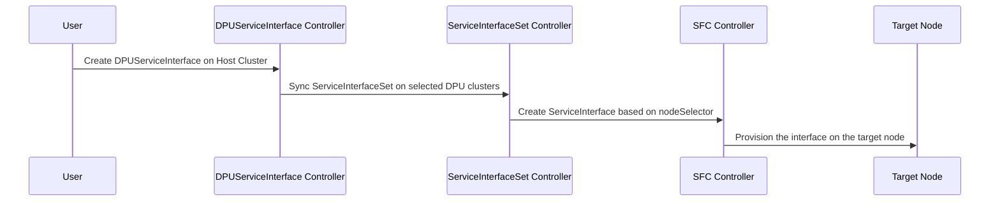

[[_TOC_]]

## Overview

The `DPUServiceInterface` Custom Resource Definition (CRD) lets you declare a network interface that should exist on
DPUs and make it available for traffic steering. A `DPUServiceInterface` is created on the host cluster and is the
top-level, user-facing object of the ServiceInterface hierarchy. Interfaces declared this way are later referenced by
[`DPUServiceChain`](dpuservicechain.md) objects (through labels) to define how traffic flows on the DPU.

A `DPUServiceInterface` can describe several types of interfaces:

1. `physical`: A physical interface that exists on the DPU (such as the uplink ports `p0`, `p1`).
2. `pf`: An interface targeting a host-facing PF of a DPU or an E/W ASTRA NIC.
3. `vf`: An interface targeting a host-facing VF of a DPU or an E/W ASTRA NIC.
4. `service`: An interface (SF) targeting a DPUService running on a set of DPUs.
5. `patch`: An interface targeting an OVS patch port to a peer OVS bridge on the DPU.

## Controller flow

The `DPUServiceInterface` controller fans the object out across DPU clusters and DPU nodes through two intermediate
objects:

1. The user creates a `DPUServiceInterface` on the host cluster.
  It targets DPU clusters selected by `spec.dpuClusterSelector` (all clusters by default).
2. The `DPUServiceInterface` controller creates a `ServiceInterfaceSet` in each selected DPU cluster.
  It targets nodes in the DPU cluster by `spec.template.spec.nodeSelector` (all nodes by default).
3. The `ServiceInterfaceSet` controller creates a `ServiceInterface` for each node that matches the
   `nodeSelector`.
4. The SFC controller provisions the actual interface (for example, connects the OVS port for the corresponding `ServiceInterface` type) on the target node.



## Object structure

A `DPUServiceInterface` nests two levels of templates before reaching the actual interface definition:

* `spec.template` — the `ServiceInterfaceSet` template applied to each selected DPU cluster.
* `spec.template.spec.template` — the `ServiceInterface` template, including its `metadata.labels` (used by
  `DPUServiceChain` to reference the interface) and its `spec` (the interface definition).

The labels set under `spec.template.spec.template.metadata.labels` are the handle that a `DPUServiceChain` uses
to select an interface, so they should be unique and descriptive.

## Usage

The interface type is set through `spec.template.spec.template.spec.interfaceType` and must be one of `physical`,
`pf`, `vf`, `service` or `patch`. The matching configuration block (`physical`, `pf`,
`vf`, `service`, `patch`) must be provided for the chosen type.

### Example: ServiceInterface of type physical for uplink ports

Exposes a physical uplink port (for example `p0`) so it can be used in a chain.

```yaml
apiVersion: svc.dpu.nvidia.com/v1alpha1
kind: DPUServiceInterface
metadata:
  name: p0
  namespace: dpf-operator-system
spec:
  template:
    spec:
      template:
        metadata:
          labels:
            uplink: "p0"
        spec:
          interfaceType: physical
          physical:
            interfaceName: p0
```

### Example: ServiceInterface of type pf for host PFs

Exposes the host-facing PF 0 of the DPU.

```yaml
apiVersion: svc.dpu.nvidia.com/v1alpha1
kind: DPUServiceInterface
metadata:
  name: pf0hpf
  namespace: dpf-operator-system
spec:
  template:
    spec:
      template:
        metadata:
          labels:
            uplink: "pf0hpf"
        spec:
          interfaceType: pf
          pf:
            pfID: 0
```

### Example: ServiceInterface of type vf

Exposes a VF, identified by its PF and VF IDs

```yaml
apiVersion: svc.dpu.nvidia.com/v1alpha1
kind: DPUServiceInterface
metadata:
  name: vf0
  namespace: dpf-operator-system
spec:
  template:
    spec:
      template:
        metadata:
          labels:
            vf: "vf0"
        spec:
          interfaceType: vf
          vf:
            pfID: 0
            vfID: 0
```

### Example: ServiceInterface of type service

A service interface represents the Scalable Function (SF) that a `DPUService` consumes. The `serviceID` must match
the `serviceID` of the `DPUService`, and `network` references the NetworkAttachmentDefinition (or
[`DPUServiceNAD`](dpuservicenad.md)) used for the secondary interface.

```yaml
apiVersion: svc.dpu.nvidia.com/v1alpha1
kind: DPUServiceInterface
metadata:
  name: eth1
  namespace: dpf-operator-system
spec:
  template:
    spec:
      template:
        metadata:
          labels:
            svc.dpu.nvidia.com/interface: "eth1"
            svc.dpu.nvidia.com/service: example-service
        spec:
          interfaceType: service
          service:
            serviceID: example-service
            network: mybrsfc
            interfaceName: eth1
```

### Example: ServiceInterface of type patch

Connects an OVS patch port to a peer bridge. The peer bridge must exist before the `DPUServiceInterface` is created.
Additional external IDs (peerExternalIDs) may be specified to add OVS metadata to the OVS interface object on the peer bridge.

```yaml
apiVersion: svc.dpu.nvidia.com/v1alpha1
kind: DPUServiceInterface
metadata:
  name: patch-to-ovn
  namespace: dpf-operator-system
spec:
  template:
    spec:
      template:
        metadata:
          labels:
            patch: "br-ovn"
        spec:
          interfaceType: patch
          patch:
            peerBridge: br-ovn
            peerExternalIDs:
              foo: bar
```

### Using a DPUServiceInterface in a DPUServiceChain

`DPUServiceInterface` objects do not steer traffic on their own; a [`DPUServiceChain`](dpuservicechain.md) references
them by the labels declared on the `ServiceInterface` template to define how traffic flows. For a full end-to-end
example that wires uplinks and service interfaces into a chain, see the
[DPUServiceChain documentation](dpuservicechain.md).

## Advanced configuration

### Selecting DPU Clusters

The `spec.dpuClusterSelector` field selects which DPU clusters the interface configuration is applied to. It uses
standard Kubernetes label selector syntax (`matchLabels` and `matchExpressions`) to match against `DPUCluster`
labels. If not specified, the configuration is applied to all DPU clusters.

```yaml
spec:
  dpuClusterSelector:
    matchLabels:
      environment: production
  template:
    ...
    ...
```

### Selecting DPU Nodes within a DPU Cluster

The `spec.template.spec.nodeSelector` field selects which Nodes within a DPU cluster the interface configuration is applied to. It uses
standard Kubernetes label selector syntax (`matchLabels` and `matchExpressions`) to match against Node
labels. If not specified, the configuration is applied to all Nodes within a cluster.

### Selecting NICs on a DPU

For `ServiceInterface` type `pf` and `vf`, in certain configurations it may be required to target a specific network device within
a DPU.

Such cases include:

1. Multi socket DPUs (such as BlueField-4) where a DPU exposes 2 PCI sockets to the host.
2. Additional E/W NICs that are managed by the DPU using ASTRA (Advanced Secure Trusted Resource Architecture).

This is achieved using the `nicSelector` field at `spec.template.spec.template.spec.<pf|vf>.nicSelector`.

The `nicSelector` supports the following fields:

* `type` (required) — The type of selector used to identify the NIC. One of:
    * `dpu` — Select the DPU's own NIC. This is the default NIC and covers the common DPU case.
    * `pci` — Select a NIC by the PCI address of one of its Embedded CPU PFs (ECPFs). Requires `pci.address`.
* `pci.address` — Required when `type` is `pci`. The PCI address of any of the target NIC's ECPFs, in the form
    `0000:03:00.0`.
* `controllerNumber` (optional) — The controller number used to find the matching representor on the DPU. A value of
    `0` targets the local controller, while `>=1` targets external controllers with the specified number. If
    unspecified, controller number `1` is used. For DPUs/NICs with socket direct, set this field
    explicitly.

> [!NOTE]
> By default (when `nicSelector` is not specified), the SFC controller will target the DPU ECPFs with controller number 1 (i.e the first pci socket exposed to the host).

#### Example: Selecting different socket of a DPU

On a multi-socket DPU (such as BlueField-4) that exposes more than one PCI socket to the host, use `type: dpu` and set
`controllerNumber` to target the controller that backs the desired socket.

```yaml
apiVersion: svc.dpu.nvidia.com/v1alpha1
kind: DPUServiceInterface
metadata:
  name: c2pf0hpf
  namespace: dpf-operator-system
spec:
  template:
    spec:
      template:
        metadata:
          labels:
            uplink: "pf0hpf"
        spec:
          interfaceType: pf
          pf:
            pfID: 0
            nicSelector:
              type: dpu
              # target the controller backing the second socket
              controllerNumber: 2
```

#### Example: Selecting different network device on a DPU (E/W NIC)

For an additional East/West NIC managed by the DPU through ASTRA, use `type: pci` and provide the PCI address of one of
that NIC's ECPFs.

```yaml
apiVersion: svc.dpu.nvidia.com/v1alpha1
kind: DPUServiceInterface
metadata:
  name: ew-pf0
  namespace: dpf-operator-system
spec:
  template:
    spec:
      template:
        metadata:
          labels:
            uplink: "ew-pf0"
        spec:
          interfaceType: pf
          pf:
            pfID: 0
            nicSelector:
              type: pci
              pci:
                # PCI address of one of the E/W NIC's ECPFs
                address: "0000:03:00.0"
```

## Constraints

* An interface on the DPU must be owned by at most one `DPUServiceInterface`.
* Constraints are not enforced at admission time, violations are detected at runtime by the SFC controller and surface as persistent errors on the resulting `ServiceInterface`.

## API Reference

The examples above use only the most common fields. For the complete list of fields and their descriptions, see the
[API Documentation](api.md#dpuserviceinterface).
