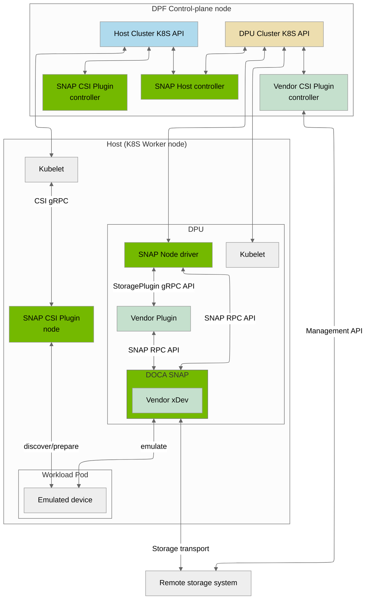
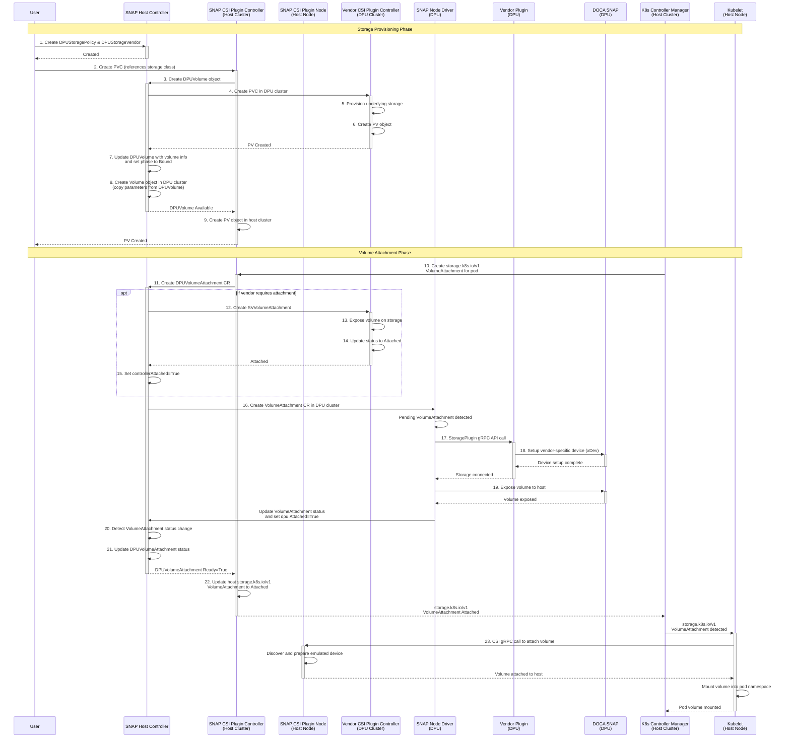
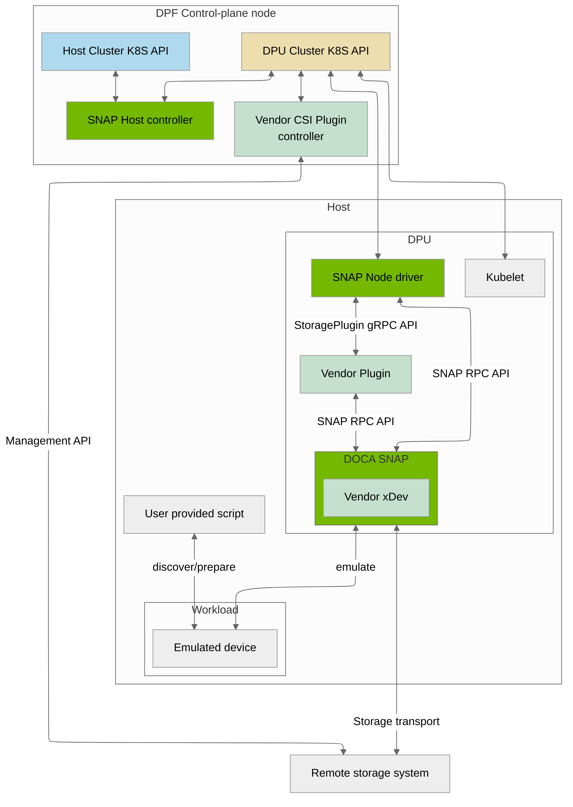
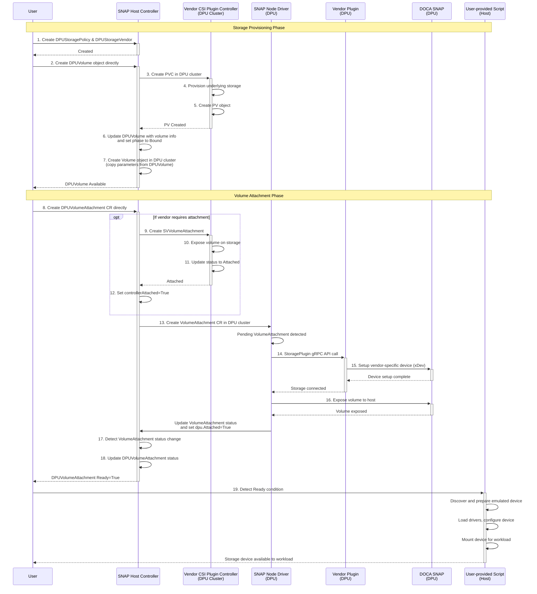
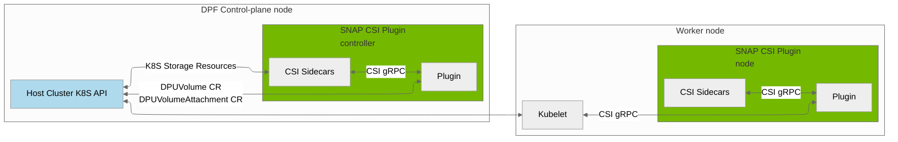
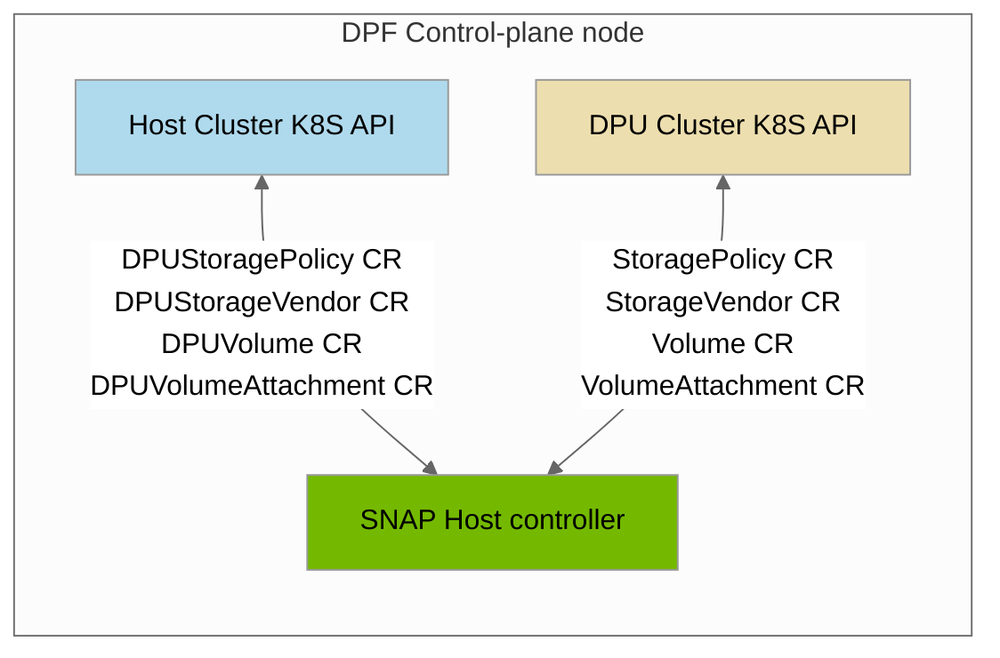
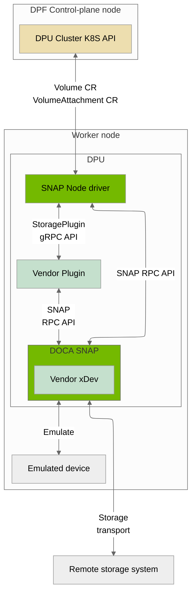
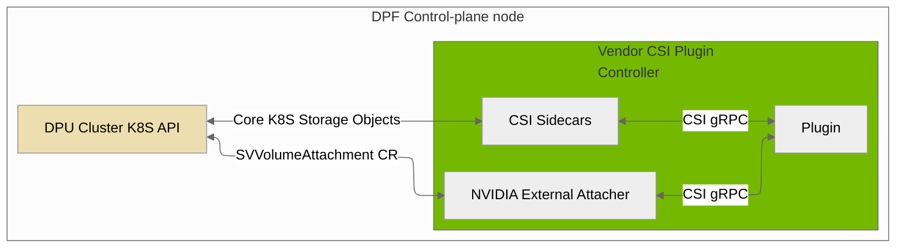
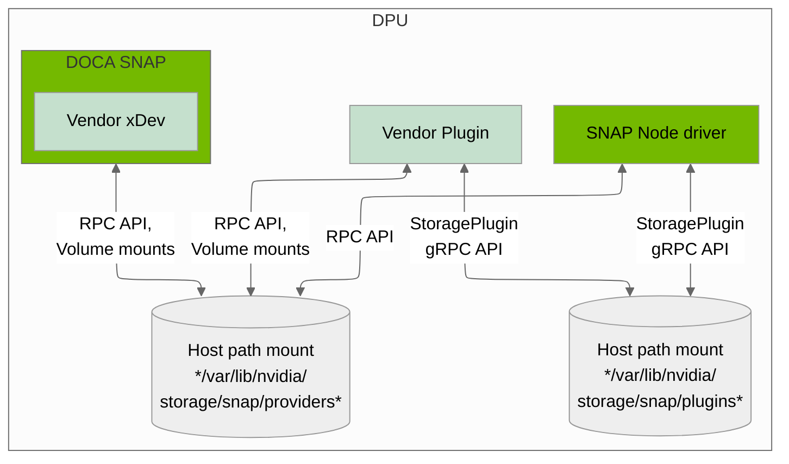

The DPF Storage Subsystem provides a framework for integrating 3rd-party storage plugins with the DPF system.
This document outlines the architecture and guidelines for developing a plugin that integrates with the
NVIDIA storage emulation service, called [DOCA SNAP](https://docs.nvidia.com/doca/sdk/doca+snap+services/index.html).

[[_TOC_]]

## Architecture

The DPF storage subsystem consists of two types of components: core components provided by NVIDIA and vendor-specific components provided by storage vendors.

Core components are included in the DPF system release and typically require no modifications from end users.

The DPF storage subsystem supports two deployment scenarios:

* [Kubernetes cluster on Host Trusted mode](#kubernetes-cluster-on-host-trusted-mode)
* [Zero Trust mode](#zero-trust-mode)

The deployed components, available features, and APIs differ in each scenario.

### Kubernetes cluster on Host Trusted mode

In this scenario, hosts function as worker nodes within the DPF management cluster. Users can utilize Kubernetes Storage APIs (StorageClass, PVC, PV, VolumeAttachment) to provision and attach storage to the host.
The hosts run the [SNAP CSI Plugin](#snap-csi-plugin), which performs all necessary actions to make storage resources available to the host.

In this scenario, the following emulation methods are supported:
* NVMe over VF on top of a static PF
* NVMe over hot-plugged PF
* Virtio-FS over hot-plugged PF

The list below contains the components that are deployed in this scenario.

The core components are:

* [SNAP CSI Plugin](#snap-csi-plugin)
* [SNAP Host Controller](#snap-host-controller)
* [SNAP Node Driver](#snap-node-driver)
* [DOCA SNAP](#doca-snap)

Vendor-specific components are:

* [Vendor CSI Plugin Controller](#vendor-csi-plugin-controller)
* [Vendor Plugin](#vendor-plugin) (optional)
* [Vendor xDev](#storage-vendor-xdev-module) (optional)

The high-level architecture of the storage subsystem for this scenario is presented in the following diagram.




#### End-to-End Flow for Trusted Kubernetes cluster on host scenario

The following steps outline the end-to-end process for provisioning and attaching storage using the DPF storage subsystem in the Trusted Kubernetes cluster on host scenario:



1. **DPUStoragePolicy and DPUStorageVendor Creation**: The user creates a [DPUStoragePolicy](#dpustoragepolicy-crd) and [DPUStorageVendor](#dpustoragevendor-crd) object in the host cluster.

2. **PVC Creation**: The user creates a **PersistentVolumeClaim (PVC)** object in the host cluster. The **PVC** references a storage class that specifies the [SNAP CSI Plugin](#snap-csi-plugin) as its provisioner. The storage class contains parameters that specify the name of a specific [DPUStoragePolicy](#dpustoragepolicy-crd).

3. **DPUVolume Object Creation**: The [SNAP CSI Plugin](#snap-csi-plugin) Controller in the host cluster handles **PVC** creation and creates a [DPUVolume](#dpuvolume-crd) object in the host cluster. This object includes references to the [DPUStoragePolicy](#dpustoragepolicy-crd) and the requested volume parameters from the storage class.

4. **Storage Vendor PVC Creation**: The [SNAP Host Controller](#snap-host-controller) merges parameters from the [DPUStoragePolicy](#dpustoragepolicy-crd) and [DPUVolume](#dpuvolume-crd), selects the appropriate [DPUStorageVendor](#dpustoragevendor-crd), and creates a **PVC** in the DPU cluster that references the storage class of the [Vendor CSI Plugin Controller](#vendor-csi-plugin-controller).

5. **Vendor Storage Provisioning**: The [Vendor CSI Plugin Controller](#vendor-csi-plugin-controller) detects the new **PVC** in the DPU cluster and provisions the underlying storage.

6. **Vendor PV Creation**: The [Vendor CSI Plugin Controller](#vendor-csi-plugin-controller) creates the corresponding **PersistentVolume (PV)** object.

7. **DPUVolume Availability Update**: The [SNAP Host Controller](#snap-host-controller) detects that the **PV** is created and updates [DPUVolume](#dpuvolume-crd) object in the host cluster with information about the created volume and sets the phase of the object to **Bound**.

8. **Volume Object Creation**: The [SNAP Host Controller](#snap-host-controller) creates a [Volume](#volume-crd) object in the DPU cluster. The controller copies parameters from the [DPUVolume](#dpuvolume-crd) object to the [Volume](#volume-crd) object.

9. **PV Object Creation**: The [SNAP CSI Plugin](#snap-csi-plugin) Controller in the host cluster detects the status change of the [DPUVolume](#dpuvolume-crd) object and creates the **PV** object in the host cluster.

10. **Volume Attachment Initiation**: The Kubernetes Controller Manager in the host cluster detects the **PV** object and creates a native Kubernetes **VolumeAttachment [storage.k8s.io/v1]** object to attach the volume to the user's pod.

11. **DPUVolumeAttachment Object Creation**: The [SNAP CSI Plugin](#snap-csi-plugin) Controller detects the new native Kubernetes **VolumeAttachment [storage.k8s.io/v1]** object and creates a corresponding [DPUVolumeAttachment](#dpuvolumeattachment-crd) CR in the host cluster.

12. **SVVolumeAttachment Creation**: The [SNAP Host Controller](#snap-host-controller) detects the new [DPUVolumeAttachment](#dpuvolumeattachment-crd) object in the host cluster. If the [Vendor CSI Plugin Controller](#vendor-csi-plugin-controller) requires attachment, it creates an [SVVolumeAttachment](#svvolumeattachment-crd) object for the [Vendor CSI Plugin Controller](#vendor-csi-plugin-controller) in the DPU cluster.

13. **Vendor Volume Exposure**: The [Vendor CSI Plugin Controller](#vendor-csi-plugin-controller) controller detects the new [SVVolumeAttachment](#svvolumeattachment-crd) object and exposes the volume on the underlying storage.

14. **Vendor Volume Attachment**: The [Vendor CSI Plugin Controller](#vendor-csi-plugin-controller) updates the status of the [SVVolumeAttachment](#svvolumeattachment-crd) object to **Attached**.

15. **DPUVolumeAttachment Status Update**: The [SNAP Host Controller](#snap-host-controller) detects that [SVVolumeAttachment](#svvolumeattachment-crd) is in **Attached** state and sets the `controllerAttached` of the [DPUVolumeAttachment](#dpuvolumeattachment-crd) to **True**.

16. **VolumeAttachment Object Creation**: The [SNAP Host Controller](#snap-host-controller) creates a [VolumeAttachment](#volumeattachment-crd) object in the DPU cluster.

17. **Storage Device Connection**: The [SNAP Node Driver](#snap-node-driver) on the DPU detects the pending [VolumeAttachment](#volumeattachment-crd) object and calls the [Vendor Plugin](#vendor-plugin) via the **StoragePlugin gRPC API** to connect the volume to the underlying storage.

18. **Vendor Plugin Device Setup**: The [Vendor Plugin](#vendor-plugin) connects the volume to the underlying storage (if required) and sets up the vendor-specific device (xDev) inside the [DOCA SNAP](#doca-snap) service.

19. **SNAP Process Volume Exposure**: The [SNAP Node Driver](#snap-node-driver) calls the [DOCA SNAP](#doca-snap) service to expose the volume to the host. Upon completion, the [SNAP Node Driver](#snap-node-driver) updates the DPU parameters in the status of the [VolumeAttachment](#volumeattachment-crd) and sets the `dpu.Attached` status to **True**.

20. **VolumeAttachment Status Detection**: The [SNAP Host Controller](#snap-host-controller) detects the status change of the [VolumeAttachment](#volumeattachment-crd) CR in the DPU cluster.

21. **DPUVolumeAttachment Status Update**: The [SNAP Host Controller](#snap-host-controller) updates the status of the [DPUVolumeAttachment](#dpuvolumeattachment-crd) object in the host cluster.

22. **Host VolumeAttachment Update**: The [SNAP CSI Plugin](#snap-csi-plugin) Controller detects that [DPUVolumeAttachment](#dpuvolumeattachment-crd) `Ready` Condition is `True` and updates the status of the native Kubernetes **VolumeAttachment [storage.k8s.io/v1]** object on the host cluster to **Attached**.

23. **Pod Volume Mounting**: The kubelet on the host node detects the native Kubernetes **VolumeAttachment [storage.k8s.io/v1]** object with status **Attached**. It calls the [SNAP CSI Plugin](#snap-csi-plugin) Node to attach the volume to the host and mounts the volume into the pod's namespace.


### Zero Trust mode

In this scenario, hosts are not trusted and the host OS configuration is not managed by DPF components. Standard Kubernetes Storage APIs (StorageClass, PVC, PV, VolumeAttachment) cannot be used in this scenario. Instead, DPF-specific storage APIs must be used to manage storage operations.

There are no DPF storage components deployed on the host. User-provided applications or scripts are responsible for performing the required actions on the host OS to make storage available to the host.

Refer to the [DOCA SNAP](https://docs.nvidia.com/doca/sdk/doca+snap+services/index.html) documentation for detailed information about required host OS configuration.

In this scenario, the following emulation methods are supported:
* NVMe over VF on top of a static PF
* NVMe over hot-plugged PF
* NVMe over static PF
* Virtio-FS over hot-plugged PF

The list below contains the components that are deployed in this scenario.

The core components are:

* [SNAP Host Controller](#snap-host-controller)
* [SNAP Node Driver](#snap-node-driver)
* [DOCA SNAP](#doca-snap)

Vendor-specific components are:

* [Vendor CSI Plugin Controller](#vendor-csi-plugin-controller)
* [Vendor Plugin](#vendor-plugin) (optional)
* [Vendor xDev](#storage-vendor-xdev-module) (optional)

The high-level architecture of the storage subsystem is presented in the following diagram.




#### End-to-End Flow Description for Zero Trust scenario

The following steps outline the end-to-end process for provisioning and attaching storage using the DPF storage subsystem in the Zero Trust scenario:



1. **DPUStoragePolicy and DPUStorageVendor Creation**: The user creates a [DPUStoragePolicy](#dpustoragepolicy-crd) and [DPUStorageVendor](#dpustoragevendor-crd) object in the host cluster.

2. **DPUVolume Object Creation**: The user directly creates a [DPUVolume](#dpuvolume-crd) object in the host cluster. This object includes references to the [DPUStoragePolicy](#dpustoragepolicy-crd) and the requested volume parameters.

3. **Storage Vendor PVC Creation**: The [SNAP Host Controller](#snap-host-controller) merges parameters from the [DPUStoragePolicy](#dpustoragepolicy-crd) and [DPUVolume](#dpuvolume-crd), selects the appropriate [DPUStorageVendor](#dpustoragevendor-crd), and creates a **PVC** in the DPU cluster that references the storage class of the [Vendor CSI Plugin Controller](#vendor-csi-plugin-controller).

4. **Vendor PV Provisioning**: The [Vendor CSI Plugin Controller](#vendor-csi-plugin-controller) detects the new **PVC** in the DPU cluster, provisions the underlying storage, and creates the corresponding **PersistentVolume (PV)** object.

5. **DPUVolume Availability Update**: The [SNAP Host Controller](#snap-host-controller) detects that the **PV** is created and updates [DPUVolume](#dpuvolume-crd) object in the host cluster with information about the created volume and sets the phase of the object to **Bound**.

6. **Volume Object Creation**: The [SNAP Host Controller](#snap-host-controller) creates a [Volume](#volume-crd) object in the DPU cluster. The controller copies parameters from the [DPUVolume](#dpuvolume-crd) object to the [Volume](#volume-crd) object.

7. **DPUVolumeAttachment Object Creation**: The user directly creates a [DPUVolumeAttachment](#dpuvolumeattachment-crd) CR in the host cluster to attach the volume to a specific host node.

8. **SVVolumeAttachment Creation**: The [SNAP Host Controller](#snap-host-controller) detects the new [DPUVolumeAttachment](#dpuvolumeattachment-crd) object in the host cluster. If the [Vendor CSI Plugin Controller](#vendor-csi-plugin-controller) requires attachment, it creates an [SVVolumeAttachment](#svvolumeattachment-crd) object for the [Vendor CSI Plugin Controller](#vendor-csi-plugin-controller) in the DPU cluster.

9. **Vendor Volume Exposure**: The [Vendor CSI Plugin Controller](#vendor-csi-plugin-controller) detects the new [SVVolumeAttachment](#svvolumeattachment-crd) object and exposes the volume on the underlying storage.

10. **Vendor Volume Attachment**: The [Vendor CSI Plugin Controller](#vendor-csi-plugin-controller) updates the status of the [SVVolumeAttachment](#svvolumeattachment-crd) object to **Attached**.

11. **DPUVolumeAttachment Status Update**: The [SNAP Host Controller](#snap-host-controller) detects that [SVVolumeAttachment](#svvolumeattachment-crd) is in **Attached** state and sets the `controllerAttached` of the [DPUVolumeAttachment](#dpuvolumeattachment-crd) to **True**.

12. **VolumeAttachment Object Creation**: The [SNAP Host Controller](#snap-host-controller) creates a [VolumeAttachment](#volumeattachment-crd) object in the DPU cluster.

13. **Storage Device Connection**: The [SNAP Node Driver](#snap-node-driver) on the DPU detects the pending [VolumeAttachment](#volumeattachment-crd) object and calls the [Vendor Plugin](#vendor-plugin) via the **StoragePlugin gRPC API** to connect the volume to the underlying storage.

14. **Vendor Plugin Device Setup**: The [Vendor Plugin](#vendor-plugin) connects the volume to the underlying storage (if required) and sets up the vendor-specific device (xDev) inside the [DOCA SNAP](#doca-snap) service.

15. **SNAP Process Volume Exposure**: The [SNAP Node Driver](#snap-node-driver) calls the [DOCA SNAP](#doca-snap) service to expose the volume to the host. Upon completion, the [SNAP Node Driver](#snap-node-driver) updates the DPU parameters in the status of the [VolumeAttachment](#volumeattachment-crd) and sets the `dpu.Attached` status to **True**.

16. **VolumeAttachment Status Detection**: The [SNAP Host Controller](#snap-host-controller) detects the status change of the [VolumeAttachment](#volumeattachment-crd) CR in the DPU cluster.

17. **DPUVolumeAttachment Status Update**: The [SNAP Host Controller](#snap-host-controller) updates the status of the [DPUVolumeAttachment](#dpuvolumeattachment-crd) object in the host cluster to indicate the volume is ready.

18. **Ready Condition Detection**: The user-provided script on the host detects that the [DPUVolumeAttachment](#dpuvolumeattachment-crd) `Ready` condition is `True`.

19. **Host Volume Preparation**: The user-provided script performs the necessary operations to discover, prepare, and make the emulated storage device available to the host workload. This includes any required driver loading, device configuration, and mounting operations.

## Core Components

### SNAP CSI Plugin

> **Note:** This component is deployed only for the [trusted Kubernetes cluster on host](#trusted-kubernetes-cluster-on-host) scenario.

The **SNAP CSI Plugin** is a Kubernetes CSI plugin responsible for managing the lifecycle of storage resources within the host cluster. It enables the nodes within the host cluster to consume storage resources provisioned by the DPF storage subsystem.

The SNAP CSI plugin handles the creation and management of Kubernetes storage resources such as **Storage Classes**, **Persistent Volumes (PV)**, and other Kubernetes Storage objects.

The plugin uses DPF storage APIs by creating [DPUVolume](#dpuvolume-crd) and [DPUVolumeAttachment](#dpuvolumeattachment-crd) custom resources in the host cluster to trigger the creation and attachment of storage resources in the DPU cluster.

The SNAP CSI Plugin consists of a controller and a node component. The controller component is deployed on control-plane nodes, while the node component is deployed on worker nodes.
The node component is responsible for discovering and preparing emulated storage devices on the host, and mounting them into Pod namespaces when requested by the kubelet.

The plugin supports two emulation modes:

| Emulation Mode | Supported `volumeMode` for PVCs in host cluster | `volumeMode` in created DPUVolume CR |
|----------------|------------------------------------------------|--------------------------------------|
| `nvme`         | Block (volume as raw block device in Pod)      | Block (volume exposed as emulated NVMe device to the host) |
| `virtiofs`     | Filesystem (volume as filesystem in Pod)       | Filesystem (volume exposed as VirtioFS to the host)        |

> **Note:** The emulation mode is set using the `--emulation-mode` flag.



Example of the StorageClass object:

```yaml
apiVersion: storage.k8s.io/v1
kind: StorageClass
metadata:
  name: snap-nvme
provisioner: csi.snap.nvidia.com
parameters:
  policy: "example-policy"
  functionType: "vf"
  hotplugFunction: "false"
```

The following combinations of `functionType` and `hotplugFunction` StorageClass parameters are supported:

| functionType | hotplugFunction | Description | emulationMode=nvme | emulationMode=virtiofs |
|--------------|-----------------|-------------|----------------|-------------------|
| `vf` | `false` | VF on top of static PF | ✅ Supported | ❌ Not supported |
| `pf` | `true` | Hot-plugged PF | ✅ Supported | ✅ Supported |
| `vf` | `true` | Hot-plugged VF | ❌ Not supported | ❌ Not supported |
| `pf` | `false` | Static PF | ❌ Not supported | ❌ Not supported |


### SNAP Host Controller

The **SNAP Host Controller** implements the user-facing DPF storage APIs, manages the synchronization of storage resources between the host cluster and the DPU cluster, and implements the core business logic of the DPF storage subsystem. Operating within the DPF control-plane, it:

* Reconciles [DPUStoragePolicy](#dpustoragepolicy-crd) and [DPUStorageVendor](#dpustoragevendor-crd) objects in the host cluster.
* Reconciles [DPUVolume](#dpuvolume-crd) objects in the host cluster, selects appropriate storage vendors, and creates PVCs directly in the DPU cluster to trigger the [Vendor CSI Plugin Controller](#vendor-csi-plugin-controller).
* Creates [Volume](#volume-crd) objects in the DPU cluster with volume information and parameters copied from [DPUVolume](#dpuvolume-crd) objects.
* Reconciles [DPUVolumeAttachment](#dpuvolumeattachment-crd) objects in the host cluster and creates corresponding [VolumeAttachment](#volumeattachment-crd) objects in the DPU cluster to trigger volume attachment operations.
* Creates [SVVolumeAttachment](#svvolumeattachment-crd) custom resources when the [Vendor CSI Plugin Controller](#vendor-csi-plugin-controller) requires [ControllerPublishVolume](https://github.com/container-storage-interface/spec/blob/master/spec.md#controllerpublishvolume)/[ControllerUnpublishVolume](https://github.com/container-storage-interface/spec/blob/master/spec.md#controllerunpublishvolume) operations.
* Monitors the status of storage resources in the DPU cluster and propagates status updates back to the corresponding resources in the host cluster




### SNAP Node Driver

The SNAP Node Driver runs on each DPU that is used to attach storage. Responsibilities include:

* Invoking the Vendor Plugin via the [StoragePlugin gRPC API](#storageplugin-api) to trigger the attachment of remote storage resources to the DOCA SNAP service.
* Interacting directly with the DOCA SNAP service via the **SNAP RPC API** to make storage resources available to the host.



### DOCA SNAP

NVIDIA DOCA SNAP technology encompasses a family of services that enable hardware-accelerated virtualization of local storage running on NVIDIA BlueField products.
The SNAP services present networked storage as local block or file system devices to the host, emulating local drives on the PCIe bus.
Additional details about the SNAP services can be found in the [DOCA SNAP documentation](https://docs.nvidia.com/doca/sdk/doca+snap+services/index.html).


## Vendor-Specific Components

### Vendor CSI Plugin Controller

This is the controller part of the standard Kubernetes CSI driver of the storage vendor which is used for any Kubernetes deployment.
It should be used to create/delete/manage the volumes on the underlying storage system.


If the storage vendor requires to support the
[ControllerPublishVolume](https://github.com/container-storage-interface/spec/blob/master/spec.md#controllerpublishvolume)/
[ControllerUnpublishVolume](https://github.com/container-storage-interface/spec/blob/master/spec.md#controllerunpublishvolume) operations,
then a small adjustment in the controller deployment mechanism is required, due to the replacement of the Kubernetes native `VolumeAttachment [storage.k8s.io/v1]` object by the [SVVolumeAttachment](#svvolumeattachment-crd) CRD object.

The original Kubernetes `external-attacher` sidecar should be replaced by a new external-attacher sidecar, provided by NVIDIA, which monitors the [SVVolumeAttachment](#svvolumeattachment-crd) objects instead of the Kubernetes native `VolumeAttachment [storage.k8s.io/v1]` objects (see diagram below).
The new external-attacher sidecar calls the `ControllerPublish` and `ControllerUnpublish` functions of the CSI controller.



An appropriate storage class that represents the CSI controller should be created on the DPU Kubernetes cluster (see example below). The reclaimPolicy field in the storage class MUST be set to Delete. The reason is that the reclaim policy is actually managed by the NVIDIA storage class.

```yaml
apiVersion: storage.k8s.io/v1
kind: StorageClass
metadata:
  name: example-vendor.example
  annotations:
    storageclass.kubernetes.io/is-default-class: "false"
provisioner: csi-driver.example-vendor.example
reclaimPolicy: Delete
```

In addition, a [DPUStorageVendor](#dpustoragevendor-crd) CR object should be created in the host cluster, and the name of the StorageClass of the storage vendor (that exists in the DPU cluster) should be set in the storageClassName parameter (see example below).

```yaml
apiVersion: storage.dpu.nvidia.com/v1alpha1
kind: DPUStorageVendor
metadata:
  name: example-vendor
  namespace: nvidia-storage
spec:
  storageClassName: "example-vendor.example"
  pluginName: "example-vendor-plugin"
```
If the storage vendor requires to support the controller attach/detach API then an appropriate `CSIDriver` object that represents the storage vendor CSI driver should be created on the DPU Kubernetes cluster (see example below), with the property attacheRequired set to True.

This object is used by the [SNAP Host Controller](#snap-host-controller) to determine if [ControllerPublishVolume](https://github.com/container-storage-interface/spec/blob/master/spec.md#controllerpublishvolume)/
[ControllerUnpublishVolume](https://github.com/container-storage-interface/spec/blob/master/spec.md#controllerunpublishvolume) operations are supported by the storage vendor.

```yaml
apiVersion: storage.k8s.io/v1
kind: CSIDriver
metadata:
  name: csi-driver.example-vendor.example
spec:
  attachRequired: true // Indicates this CSI volume driver requires an attach operation
```

NVIDIA provides several sample Vendor CSI plugin controllers that can be used as references. Helm charts for these controllers are available in the [DPF Storage Vendors Charts repository](https://github.com/Mellanox/dpf-storage-vendors-charts).

> **Note:** These plugins are not intended to be used in production environments.


### Vendor Plugin

> **Note:** Vendors can use the plugins provided by NVIDIA or implement their own if needed. NVIDIA provides the following plugins: `nvidia-block` (uses NVMe-oF) and `nvidia-fs` (uses NFS-kernel client).

The concept of this component is very similar to the Kubernetes CSI node-driver.
It is responsible to translate the [StoragePlugin API](#storageplugin-api) into the storage vendor specific RPC calls.

The plugin requires direct access to the DPU.
It should expose a gRPC interface through a UNIX domain socket which should be shared through a HostPath volume on the DPU worker node.
This socket is used by the [SNAP Node Driver](#snap-node-driver) to make calls to this component.
It is responsible for creating the UNIX domain socket in the following shared folder: `/var/lib/nvidia/storage/snap/plugins/{plugin-name}/dpu.sock`, where `plugin-name` represent the name of the ***Vendor plugin***.

If a plugin needs to mount filesystems or block devices to the [DOCA SNAP](#doca-snap) Pod before creating a `bdev` or `fsdev`,
it should use the following path: `/var/lib/nvidia/storage/snap/providers/{provider-name}/volumes/{plugin-name}/{volume-id}`, where `provider-name` is the name of the [DOCA SNAP](#doca-snap) provider that the plugin uses, `plugin-name` is the name of the ***Vendor plugin***, and `volume-id` is the ID of the volume.

It interacts with the [Storage vendor xDev module](#storage-vendor-xdev-module), linked with the [DOCA SNAP](#doca-snap), through the SNAP UNIX domain socket which should be also shared through a HostPath volume on the DPU worker node.
The connections between the node components are described in the diagram below.



#### Storage vendor xDev module
This is an optional SPDK device module which provides storage-specific logic inside the SNAP service. If exists - it should be managed by the storage vendor DPU plugin component.
The module is deployed as a static or shared library along with the SNAP service.

## Custom Resource Definitions (CRDs)

### Public API

These are the APIs that users directly interact with to manage storage resources.

#### DPUStoragePolicy CRD

Defines a storage policy that maps between a policy and a list of DPU storage vendors.

```yaml
apiVersion: storage.dpu.nvidia.com/v1alpha1
kind: DPUStoragePolicy
metadata:
  name: example-dpu-storage-policy
spec:
  dpuStorageVendors:
    - example-vendor-1
    - example-vendor-2
  selectionAlgorithm: NumberVolumes  # Random or NumberVolumes
  parameters:
    parameter1: value1
    parameter2: value2
```

#### DPUStorageVendor CRD

Represents a DPU storage vendor. Each storage vendor must have exactly one `DPUStorageVendor` custom resource.

```yaml
apiVersion: storage.dpu.nvidia.com/v1alpha1
kind: DPUStorageVendor
metadata:
  name: example-vendor
spec:
  storageClassName: example-vendor-storage-class
  pluginName: example-vendor-plugin
```

#### DPUVolume CRD

Represents a persistent volume that will be provisioned by the DPF storage subsystem.

```yaml
apiVersion: storage.dpu.nvidia.com/v1alpha1
kind: DPUVolume
metadata:
  name: example-volume
spec:
  dpuStoragePolicyName: example-dpu-storage-policy
  accessModes:
    - ReadWriteOnce
  resources:
    requests:
      storage: 10Gi
  volumeMode: Filesystem  # Filesystem or Block
  parameters:
    parameter1: value1
```

> **Note:** The `volumeMode` field controls which emulation method will be used for the volume.
> For `Filesystem` mode, the volume will be exposed to the host as a Virtio-FS device. For `Block` mode, the volume will be exposed as an emulated NVMe device.

#### DPUVolumeAttachment CRD

Captures the intent to attach/detach a DPU volume to/from a specific DPU node.

```yaml
apiVersion: storage.dpu.nvidia.com/v1alpha1
kind: DPUVolumeAttachment
metadata:
  name: example-volume-attachment
spec:
  dpuVolumeName: example-volume
  dpuNodeName: dpu-node-01
  functionType: vf
  hotplugFunction: false
```

> **Note:** The `functionType` and `hotplugFunction` fields control the function type used for volume attachment.
> Currently supported combinations are `vf` with `false` (VF on top of a static PF) and `pf` with `true` (hot-plugged PF).

### Internal API

These APIs are not intended to be directly used by end users.
They are included here for reference only.

#### SVVolumeAttachment CRD

Captures the intent to attach/detach the specified volume to/from the specified node for the storage vendor.

```yaml
apiVersion: storage.dpu.nvidia.com/v1alpha1
kind: SVVolumeAttachment
metadata:
  name: sv-volume-attachment-example
spec:
  attacher: vendor-plugin
  nodeName: node01
  source:
    persistentVolumeName: pv-example
```

#### VolumeAttachment CRD

Captures the intent to attach/detach the specified NVIDIA volume to/from the specified node.

```yaml
apiVersion: storage.dpu.nvidia.com/v1alpha1
kind: VolumeAttachment
metadata:
  name: nv-volume-attachment-example
spec:
  nodeName: node01
  source:
    volumeRef:
      name: volume-example
      namespace: default
  parameters:
    parameter1: value1
  functionType: vf  # pf or vf
  hotplugFunction: false
status:
  storageAttached: true
  dpu:
    attached: true
    pciDeviceAddress: "0000:03:00.0"
    deviceName: nvme0n1
    bdevAttrs:
      nvmeNsID: 1
      nvmeUUID: "12345678-1234-1234-1234-123456789012"
```

#### Volume CRD

Represents a persistent volume on the DPU cluster, mapping between the tenant K8s PV object and the actual volume on the DPU cluster.

```yaml
apiVersion: storage.dpu.nvidia.com/v1alpha1
kind: Volume
metadata:
  name: volume-example
spec:
  request:
    capacityRange:
      request: "10Gi"
    accessModes:
      - ReadWriteOnce
    volumeMode: Filesystem
  storagePolicyRef:
    name: example-storage-policy
    namespace: default
  storageParameters:
    policy: example-storage-policy
    parameter1: value1
  volume:
    id: volume-12345
    capacity: "10Gi"
    accessModes:
      - ReadWriteOnce
    reclaimPolicy: Delete
    storageVendorName: example-vendor
    storageVendorPluginName: example-vendor-plugin
status:
  state: Available
```


## StoragePlugin API

Each vendor plugin must implement the following gRPC API to interact with the DPF storage subsystem:


### Services

```proto
syntax = "proto3";

package nvidia.storage.plugins.v1;

import "google/protobuf/wrappers.proto";

// The Identity service provides APIs to identify the plugin and verify its health.
service IdentityService {
  // GetPluginInfo returns the name and version of the plugin.
  rpc GetPluginInfo(GetPluginInfoRequest) returns (GetPluginInfoResponse);

  // Probe checks the health and readiness of the plugin.
  rpc Probe(ProbeRequest) returns (ProbeResponse);
}

// The StoragePlugin service provides APIs to manage storage devices.
service StoragePluginService {
  // StoragePluginGetCapabilities returns the capabilities supported by the plugin.
  rpc StoragePluginGetCapabilities(StoragePluginGetCapabilitiesRequest)
      returns (StoragePluginGetCapabilitiesResponse);

  // GetSNAPProvider retrieves the name of the SNAP provider used by the plugin.
  rpc GetSNAPProvider(GetSNAPProviderRequest) returns (GetSNAPProviderResponse);

  // CreateDevice creates a new storage device and exposes it.
  rpc CreateDevice(CreateDeviceRequest) returns (CreateDeviceResponse);

  // DeleteDevice removes a storage device.
  rpc DeleteDevice(DeleteDeviceRequest) returns (DeleteDeviceResponse);

  // GetDevice gets a storage device.
  rpc GetDevice(GetDeviceRequest) returns (GetDeviceResponse);

  // ListDevices list all devices information
  rpc ListDevices(ListDevicesRequest) returns (ListDevicesResponse);
}
```

All the RPC methods that are not implemented by the plugin MUST reply with the non-ok gRPC status code, `12 UNIMPLEMENTED`.

Any of the RPCs defined above may timeout and may be retried.
The [SNAP Node Driver](#snap-node-driver) may choose the maximum time it is willing to wait for a call, how long it waits between retries, and how many times it retries (these values are not negotiated between plugin and [SNAP Node Driver](#snap-node-driver)).

Idempotency requirements ensure that a retried call with the same fields continues where it left off when retried. The only way to cancel a call is to issue a "negation" call if one exists. For example, issue a DeleteDevice call to cancel a pending CreateDevice operation.

### GetPluginInfo

This method should return the name of the plugin (e.g., example-vendor-plugin.example) and the version of the plugin (e.g., 1.0). On success, the method should reply 0 OK in the gRPC status code.

If the plugin is unable to complete the `GetPluginInfo` call successfully, it MUST reply a non-ok gRPC code in the gRPC status.

**Return codes:**

| Number | Code | Description |
| :---: | :--- | :--- |
| 0 | OK | |
| 9 | FAILED_PRECONDITION | Plugin is unable to complete the call successfully |

```proto
// GetPluginInfoRequest is used to request the plugin's information.
message GetPluginInfoRequest {}

// GetPluginInfoResponse provides the plugin's name, version, and manifest details.
message GetPluginInfoResponse {
  // The name of the plugin. It must follow domain name notation format
  // (https://tools.ietf.org/html/rfc1035#section-2.3.1) and must be 63 characters
  // or less. This field is required.
  string name = 1;

  // The version of the plugin. This field is required.
  string vendor_version = 2;

  // The manifest provides additional opaque information about the plugin.
  // This field is required.
  map<string, string> manifest = 3;
}
```

### Probe
This API is called to verify that the plugin is in a healthy and ready state. If an unhealthy state is reported, via a non-success response, the CO (in our case Kubernetes) may take action with the intent to bring the plugin to a healthy state (e.g., restarting the plugin container).

The plugin should verify its internal state and returns 0 OK if the validation succeeds. If the plugin is still initializing, but is otherwise perfectly healthy, it shall return 0 OK with the ready field set to False.

**Return codes:**

| Number | Code | Description |
| :---: | :--- | :--- |
| 0 | OK | |
| 9 | FAILED_PRECONDITION | Plugin is unable to complete the call successfully |

```proto
// ProbeRequest is used to check the plugin's health and readiness.
message ProbeRequest {}

// ProbeResponse indicates the plugin's health and readiness status.
message ProbeResponse {
  // Ready indicates whether the plugin is healthy and ready.
  google.protobuf.BoolValue ready = 1;
}
```

### StoragePluginGetCapabilities
This API allows the SNAP Node-Driver to check the supported capabilities of the storage service provided by the plugin.

If the plugin is unable to complete the `StoragePluginGetCapabilities` call successfully, it MUST return a non-ok gRPC code in the gRPC status.

**Return codes:**

| Number | Code | Description |
| :---: | :--- | :--- |
| 0 | OK | |
| 9 | FAILED_PRECONDITION | Plugin is unable to complete the call successfully |

```proto
// StoragePluginGetCapabilitiesRequest is used to request the plugin's capabilities.
message StoragePluginGetCapabilitiesRequest {}

// StoragePluginGetCapabilitiesResponse provides the list of supported capabilities.
message StoragePluginGetCapabilitiesResponse {
  // Capabilities supported by the plugin.
  repeated StoragePluginServiceCapability capabilities = 1;
}

// StoragePluginServiceCapability describes a capability of the storage plugin service.
message StoragePluginServiceCapability {
  // RPC specifies an RPC capability type.
  message RPC {
    // Type defines the specific capability.
    enum Type {
      // UNSPECIFIED indicates an undefined capability.
      TYPE_UNSPECIFIED = 0;

      // CREATE_DELETE_BLOCK_DEVICE indicates support for block device creation and deletion.
      TYPE_CREATE_DELETE_BLOCK_DEVICE = 1;

      // CREATE_DELETE_FS_DEVICE indicates support for filesystem device creation and deletion.
      TYPE_CREATE_DELETE_FS_DEVICE = 2;

      // GET_DEVICE_STATS indicates support for retrieving device statistics.
      TYPE_GET_DEVICE_STATS = 3;

      // LIST_DEVICES indicates support for listing devices.
      TYPE_LIST_DEVICES = 4;
    }

    // The type of the capability.
    Type type = 1;
  }

  // The specific type of capability.
  oneof type {
    // Specifies the RPC capabilities of the service.
    RPC rpc = 1;
  }
}
```

### GetSNAPProvider
The API is called by the [SNAP Node Driver](#snap-node-driver) to retrieve the name of the SNAP provider used by the plugin.
If the plugin uses the default SNAP process (provided by NVIDIA) then an empty string should be returned. Otherwise, a unique name represents the SNAP process used by this plugin should be returned. The name is used to identify the UNIX domain socket used by both the plugin and the [SNAP Node Driver](#snap-node-driver) to communicate with the SNAP process.

If the plugin is unable to complete the `GetSNAPProvider` call successfully, it MUST return a non-ok gRPC code in the gRPC status.

**Return codes:**

| Number | Code | Description |
| :---: | :--- | :--- |
| 0 | OK | |
| 9 | FAILED_PRECONDITION | Plugin is unable to complete the call successfully |


```proto
// GetSNAPProviderRequest is used to retrieve the SNAP provider's name.
message GetSNAPProviderRequest {}

// GetSNAPProviderResponse provides the SNAP provider's name.
message GetSNAPProviderResponse {
  // The name of the SNAP provider. If this field is empty, the default provider
  // (e.g., NVIDIA) is used. This field is optional.
  string provider_name = 1;
}
```

### CreateDevice
The API is called by the [SNAP Node Driver](#snap-node-driver) prior to the volume being exposed by SNAP.

The operation must be idempotent. If the device corresponding to the volume_id is already created and is identical to the specified access_modes and volume_mode the plugin must reply 0 OK with the corresponding CreateDeviceResponse message.

Business logic required by the plugin:
1. Allocate a unique device name to be used by SNAP
2. Connect the device to the underlying storage system by using the storage vendor specific APIs (if needed).
3. Provide the device to the SNAP process by using the SNAP JSON-RPC APIs. For example: fsdev_aio_create aio0 /host-folder
4. Return the device name

If the plugin is unable to complete the `CreateDevice` call successfully, it MUST return a non-ok gRPC code in the gRPC status.

**Return codes:**

| Number | Code | Description |
| :---: | :--- | :--- |
| 0 | OK | |
| 9 | FAILED_PRECONDITION | Plugin is unable to complete the call successfully |


```proto
// CreateDeviceRequest is used to create a new storage device.
message CreateDeviceRequest {
  // The unique identifier for the volume.
  string volume_id = 1;

  // The access modes for the volume.
  repeated AccessMode access_modes = 2;

  // The volume mode, either Filesystem or Block. Default is Filesystem.
  string volume_mode = 3;

  // Static properties of the volume. This field is optional.
  map<string, string> publish_context = 4;

  // Static properties of the volume. This field is optional.
  map<string, string> volume_context = 5;

  // Static properties of the storage class. This field is optional.
  map<string, string> storage_parameters = 6;
}

// CreateDeviceResponse provides the details of the created device.
message CreateDeviceResponse {
  // The name of the created device (e.g., SPDK FSdev/Bdev name).
  string device_name = 1;
}

// AccessMode specifies how a volume can be accessed.
enum AccessMode {
  // ACCESS_MODE_UNSPECIFIED indicates an unspecified access mode.
  ACCESS_MODE_UNSPECIFIED = 0;

  // ACCESS_MODE_RWO indicates read/write on a single node.
  ACCESS_MODE_RWO = 1;

  // ACCESS_MODE_ROX indicates read-only on multiple nodes.
  ACCESS_MODE_ROX = 2;

  // ACCESS_MODE_RWX indicates read/write on multiple nodes.
  ACCESS_MODE_RWX = 3;

  // ACCESS_MODE_RWOP indicates read/write on a single pod.
  ACCESS_MODE_RWOP = 4;
}
```

### DeleteDevice
The API is called by the [SNAP Node Driver](#snap-node-driver) after the device has been deleted from SNAP.

The operation must be idempotent. If the device corresponding to the volume_id and the device_name does not exist, the plugin must reply 0 OK.

Business logic required by the plugin:
1. Remove the device from the SNAP process.
2. Disconnect the device from the underlying storage system by using the storage vendor specific APIs (if needed).

If the plugin is unable to complete the `DeleteDevice` call successfully, it MUST return a non-ok gRPC code in the gRPC status.

**Return codes:**

| Number | Code | Description |
| :---: | :--- | :--- |
| 0 | OK | |
| 9 | FAILED_PRECONDITION | Plugin is unable to complete the call successfully |


```proto
// DeleteDeviceRequest is used to delete a storage device.
message DeleteDeviceRequest {
  // The unique identifier for the volume.
  string volume_id = 1;

  // The name of the device to be deleted.
  string device_name = 2;
}

// DeleteDeviceResponse is the response for deleting a device.
message DeleteDeviceResponse {}
```

### ListDevices
A Storage vendor plugin must implement this API if it has LIST_DEVICES capability. The plugin shall return the information about all the devices that it knows about. If devices are created and/or deleted while the [SNAP Node Driver](#snap-node-driver) is concurrently paging through ListDevices results then it is possible that the [SNAP Node Driver](#snap-node-driver) may either witness duplicate devices in the list, not witness existing devices, or both. The [SNAP Node Driver](#snap-node-driver) shall not expect a consistent "view" of all devices when paging through the device list via multiple calls to ListDevices.

If the plugin is unable to complete the `ListDevices` call successfully, it MUST return a non-ok gRPC code in the gRPC status.

**Return codes:**

| Number | Code | Description |
| :---: | :--- | :--- |
| 0 | OK | |
| 10 | ABORTED | Indicates that starting_token is not valid |


```proto
message ListDevicesRequest {
  // number of entries that can be returned.
  int32 max_entries = 1;

  // A token to specify where to start paginating. Set this field to
  // `next_token` returned by a previous `ListDevices` call to get the
  // next page of entries.
  string starting_token = 2;
}

message ListDevicesResponse {

  message Entry {
    string volume_id = 1;
    string device_name = 2;
  }

  repeated Entry entries = 1;

  // This token allows the caller to get the next page of entries for
  // `ListDevices` request.
  string next_token = 2;
}

```

### GetDevice
A Storage vendor plugin must implement this API if it has GET_DEVICE_STATS capability. The plugin shall return the information about the device corresponding to the volume_id and the device_name.

If the device corresponding to the volume_id and the device_name does not exist, the plugin must reply 5 NOT_FOUND.

If the plugin is unable to complete the GetDevice call successfully, it MUST return a non-ok gRPC code in the gRPC status.

**Return codes:**

| Number | Code | Description |
| :---: | :--- | :--- |
| 0 | OK | |
| 5 | NOT_FOUND | The device was not found |
| 9 | FAILED_PRECONDITION | Plugin is unable to complete the call successfully |

```proto
// GetDeviceRequest is used to get information about the device
message GetDeviceRequest {
  // volume identifier
  string volume_id = 1;

  // The device name. For example, SPDK FSdev/Bdev name
  string device_name = 2;
}

message GetDeviceResponse {
  // list of access modes for the volume.
  repeated AccessMode access_modes = 1;

  // Indicates the volume mode. Either Filesystem or Block. Default value is Filesystem. This field is OPTIONAL
  string volume_mode = 2;

  // Opaque static publish properties of the volume. This field is OPTIONAL
  map<string, string> publish_context = 3;

  // Opaque static properties of the volume. This field is OPTIONAL
  map<string, string> volume_context = 4;

  // Opaque static properties of the storage class. This field is OPTIONAL
  map<string, string> storage_parameters = 5;
}
```

## Deployment

Example manifests for DPF storage subsystem components can be found [DPF repo](https://github.com/nvidia/doca-platform) under `dpuservices/storage/examples`.
