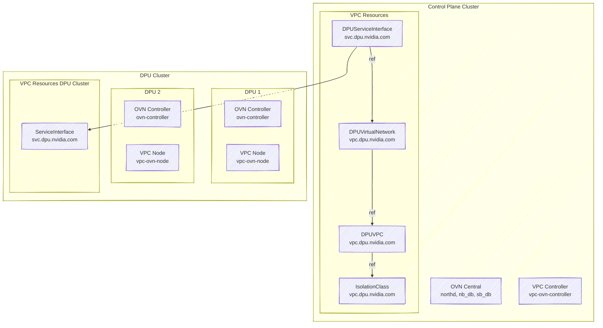
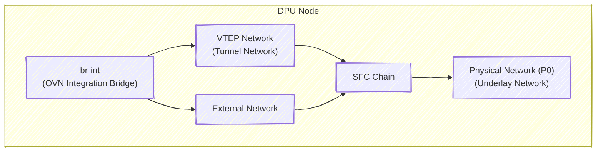

> [!NOTE] The OVN VPC service is considered a tech preview and is not recommended for production use.

[TOC]

## Overview

The DOCA VPC OVN Service provides accelerated Virtual Private Cloud (VPC) networking functionality for the DOCA Platform Framework (DPF). Built on top of Open Virtual Network (OVN), this service enables network isolation, virtualization, and advanced SDN capabilities directly on NVIDIA DPUs.

### Key Features

* **Multi-tenant Network Isolation**: Create isolated VPCs for different tenants with guaranteed network separation.
* **Virtual Network Management**: Support the creation of virtual networks with DHCP and custom IP addressing.
* **External Connectivity**: Configurable external routing with NAT/masquerading capabilities.
* **Hardware Acceleration**: Leverages DPU hardware acceleration for high-performance networking.
* **Flexible Topology**: Support for complex network topologies with inter-network routing controls.
* **Kubernetes Integration**: Native Kubernetes resources for declarative VPC management.

## Architecture

The OVN VPC service consists of several key components that work together:



### Component Responsibilities

#### Control Plane Components

* **OVN Central**: Centralized SDN control plane managing OVN northbound and southbound databases.
* **VPC Controller**: Manages VPC-specific Kubernetes resources and coordinates with OVN Central.

#### DPU Cluster Components

* **OVN Controller**: Local SDN data plane on the DPU, implementing network policies and packet forwarding.
* **VPC Node**: Handles local VPC networking operations, including IP allocation and interface management.

### VPC Kubernetes Resources

* **IsolationClass**: Configuration parameters for VPC implementation.
* **DPUVPC**: A Virtual Private Cloud resource that defines an isolated network environment for a tenant, including DPU node selection and isolation configuration.
* **DPUVirtualNetwork**: A logical network segment within a VPC.
* **DPUServiceInterface**: A control plane resource that defines network interface configuration for virtual networks.
* **ServiceInterface**: Physical and virtual network interfaces managed by the DPU that implement network connectivity.

#### DPU Network Configuration

The following diagram depicts the network configuration for a DPU, as facilitated by the OVN VPC service.



* **OVN Integration Bridge**: The main bridge (OVS) that connects interfaces to OVN and handles OVN flows.
* **VTEP Network**: The tunnel endpoint interface that enables overlay network connectivity between DPUs.
* **External Network**: The interface that provides connectivity to external networks outside the VPC.
* **Physical Network**: The primary network interface (typically p0) that connects the DPU to the physical network infrastructure.

## API Overview

For the full API definition, refer to [DPF API Documentation](../../api/api.md).

### IsolationClass

An IsolationClass defines the parameters to be used by the VPC implementation when reconciling a DPUVPC. It specifies:

* **Provisioner**: The VPC provisioner (ovn.vpc.dpu.nvidia.com).
* **Parameters**: Implementation-specific parameters. In this case, OVN-specific configuration such as database endpoints.
* **Cluster Scope**: Shared across all VPCs using the same isolation class.

<details markdown="1"><summary>Reference Example</summary>

[embedmd]:#(examples/reference-isolationclass.yaml)
```yaml
apiVersion: vpc.dpu.nvidia.com/v1alpha1
kind: IsolationClass
metadata:
  name: ovn.vpc.dpu.nvidia.com
spec:
  # Provisioner type
  provisioner: "ovn.vpc.dpu.nvidia.com"
  
  # OVN-specific parameters
  parameters:
    # OVN northbound database endpoint
    ovn-nb-endpoint: "tcp:10.1.1.100:30641"
    # Connection retry interval (Default: 5 seconds)
    ovn-nb-reconnect-time: "5"
```
</details>

> [!NOTE] `ovn-nb-endpoint` should be set to an IP address through which the OVN service is accessible (e.g. the IP of a control plane node).

### DPUVPC

A DPUVPC represents a Virtual Private Cloud—an isolated network environment for a specific tenant. It defines:

* **Tenant Ownership**: Each VPC belongs to a specific tenant.
* **Node Selection**: Specifies which DPU nodes participate in the VPC.
* **Isolation Class**: The isolation mechanism (OVN-based) to use, referenced by name.
* **Inter-Network Access**: Whether virtual networks within the VPC can communicate.

<details markdown="1"><summary>Reference Example</summary>

[embedmd]:#(examples/reference-dpuvpc.yaml)
```yaml
apiVersion: vpc.dpu.nvidia.com/v1alpha1
kind: DPUVPC
metadata:
  name: example-vpc
  namespace: default
spec:
  # Tenant identifier
  tenant: my-tenant
  
  # Optional: Select specific DPU nodes (empty = all nodes)
  nodeSelector: {}
  
  # Isolation class to use, referenced by name
  isolationClassName: "ovn.vpc.dpu.nvidia.com"
  
  # Whether virtual networks within the DPUVPC can communicate with each other
  interNetworkAccess: true
```
</details>

> [!NOTE] A DPU node can belong to at most one DPUVPC, as selected by the `spec.nodeSelector` field.

### DPUVirtualNetwork

A DPUVirtualNetwork defines a logical network segment within a VPC and supports:

* **Bridged Networks**: Layer 2 bridged networks with DHCP support.
* **External Routing**: Optional external connectivity with masquerading.
* **IP Address Management**: Automated DHCP with configurable subnets and exclusions.
* **Node Selection**: Selective deployment across DPU nodes.

<details markdown="1"><summary>Reference Example</summary>

[embedmd]:#(examples/reference-dpuvirtualnetwork.yaml)
```yaml
apiVersion: vpc.dpu.nvidia.com/v1alpha1
kind: DPUVirtualNetwork
metadata:
  name: example-network
  namespace: default
spec:
  # VPC this network belongs to, references a DPUVPC by name in the same namespace
  vpcName: "example-vpc"
  
  # Network type (currently only Bridged is supported)
  type: "Bridged"
  
  # Enable routing to external networks
  externallyRouted: true
  
  # Enable NAT for external traffic (default: true)
  masquerade: true
  
  # Bridged network configuration
  bridgedNetwork:
    ipam:
      ipv4:
        # Enable DHCP server
        dhcp: true
        # Network subnet (first IP becomes gateway)
        subnet: "192.178.0.0/16"
        # Optional: Exclude specific IPs from DHCP
        excludeIPs:
          - ip: "192.178.100.10"
          - range:
              start: "192.178.100.100"
              end: "192.178.100.110"
```
</details>

### DPUServiceInterface

A DPUServiceInterface defines a network interface for DPUs that can be used by workloads running on the DPU or Host. You can reference a DPUVirtualNetwork by name to indicate that the specified DPUServiceInterface should be connected to a specific virtual network.

Supported interface types: `PF`, `VF`, `Service`.

> [!NOTE] A DPUServiceInterface of type `Service` is intended for advanced use cases where a DPUService network interface needs to be connected to a virtual network. see *Advanced Use-Cases* section below

<details markdown="1"><summary>Reference Example</summary>

[embedmd]:#(examples/reference-dpuserviceinterface.yaml)
```yaml
apiVersion: svc.dpu.nvidia.com/v1alpha1
kind: DPUServiceInterface
metadata:
  name: vf2-example-network
  namespace: default
spec:
  template:
    spec:
      template:
        spec:
          interfaceType: vf
          vf:
            pfID: 0
            vfID: 2
            parentInterfaceRef: ""
            # DPUVirtualNetwork reference by name in the same namespace
            virtualNetwork: example-network
```
</details>

## Deployment & Prerequisites

Please follow the [OVN VPC deployment guide](../../user-guides/vpc_only/README.md) to deploy the OVN VPC Service.

## OVN VPC Network Features

1. **Intra-VPC Communication**:
   * Traffic between virtual networks within the same VPC is controlled by the `spec.interNetworkAccess` setting in DPUVPC.
   * When enabled, routing is handled by OVN logical routers.
   * When disabled, networks are completely isolated.

2. **External Connectivity**:
   * Virtual networks with `spec.externallyRouted: true` can reach external networks.
   * Outbound traffic is masqueraded by default unless `spec.masquerade: false`.

3. **DHCP Services**:
   * Each virtual network with `spec.bridgedNetwork.ipam.ipv4.dhcp: true` gets an OVN DHCP server.
   * The first IP in the subnet becomes the gateway.
   * IP exclusions are supported for static assignments.

## VPC Network Topology Examples

All examples below assume OVN VPC is deployed together with an `IsolationClass` named `ovn.vpc.dpu.nvidia.com` as described in the deployment guide.

After applying each example, check the [status of the resources](#resource-status). Once all resources are ready, you can test connectivity on the host between VF interfaces that correspond to the specified DPUServiceInterface by:

1. Requesting DHCP from OVN (e.g., using `dhclient -v -1 <interface>`).
2. Running traffic between host network interfaces.

### 1. Single VPC with a single DPUVirtualNetwork and a DPUServiceInterface targeting all DPU Nodes

This basic example allows hosts to communicate with each other (E/W) and to communicate with the external network behind NAT in an isolated manner (e.g., in case the network infrastructure is shared with additional nodes).

The topology consists of:
1. A DPUVPC: `testvpc`
2. A DPUVirtualNetwork: `testnet1`
3. A DPUServiceInterface of type `VF` targeting VF ID `2`: `testnet1-vf2`

<details markdown="1"><summary>VPC Example Topology</summary>

[embedmd]:#(examples/example-topology-1.yaml)
```yaml
---
apiVersion: vpc.dpu.nvidia.com/v1alpha1
kind: DPUVPC
metadata:
  name: testvpc
  namespace: default
spec:
  tenant: foo
  isolationClassName: ovn.vpc.dpu.nvidia.com
  interNetworkAccess: true
  nodeSelector: {}
---
apiVersion: vpc.dpu.nvidia.com/v1alpha1
kind: DPUVirtualNetwork
metadata:
  name: testnet1
  namespace: default
spec:
  vpcName: testvpc
  nodeSelector: {}
  type: Bridged
  externallyRouted: true
  masquerade: true
  bridgedNetwork:
    ipam:
      ipv4:
        dhcp: true
        subnet: 192.178.0.0/16
---
apiVersion: svc.dpu.nvidia.com/v1alpha1
kind: DPUServiceInterface
metadata:
  name: testnet1-vf2
  namespace: default
spec:
  template:
    spec:
      template:
        spec:
          interfaceType: vf
          vf:
            pfID: 0
            vfID: 2
            parentInterfaceRef: ""
            virtualNetwork: testnet1
```
</details>

### 2. Single VPC with Two DPUVirtualNetworks and Two DPUServiceInterfaces targeting separate DPU nodes

This example associates different DPU nodes with different DPUVirtualNetworks within the same VPC.

The topology consists of:
1. A DPUVPC: `testvpc`
2. Two DPUVirtualNetworks: `testnet1`, `testnet2`
3. Two DPUServiceInterfaces targeting different DPU nodes by label: `testnet1-vf2`, `testnet2-vf2`

DPU nodes should be labeled with a distinct label to allow the association of each DPUServiceInterface to a distinct set of nodes.

In this example, we assume two groups of DPU nodes are labeled with `vpc.dpu.nvidia.com/network=testnet1` and `vpc.dpu.nvidia.com/network=testnet2` respectively.

Hosts can communicate with each other (E/W) in an isolated manner as well as reach the external network behind NAT. Nodes will belong to different virtual networks (subnets) according to the specified label.

<details markdown="1"><summary>VPC Example Topology</summary>

[embedmd]:#(examples/example-topology-2.yaml)
```yaml
---
apiVersion: vpc.dpu.nvidia.com/v1alpha1
kind: DPUVPC
metadata:
  name: testvpc
  namespace: default
spec:
  tenant: foo
  isolationClassName: ovn.vpc.dpu.nvidia.com
  interNetworkAccess: true
  nodeSelector: {}
---
apiVersion: vpc.dpu.nvidia.com/v1alpha1
kind: DPUVirtualNetwork
metadata:
  name: testnet1
  namespace: default
spec:
  vpcName: testvpc
  nodeSelector: {}
  type: Bridged
  externallyRouted: true
  masquerade: true
  bridgedNetwork:
    ipam:
      ipv4:
        dhcp: true
        subnet: 192.178.0.0/16
---
apiVersion: vpc.dpu.nvidia.com/v1alpha1
kind: DPUVirtualNetwork
metadata:
  name: testnet2
  namespace: default
spec:
  vpcName: testvpc
  nodeSelector: {}
  type: Bridged
  externallyRouted: true
  masquerade: true
  bridgedNetwork:
    ipam:
      ipv4:
        dhcp: true
        subnet: 192.188.0.0/16
---
apiVersion: svc.dpu.nvidia.com/v1alpha1
kind: DPUServiceInterface
metadata:
  name: testnet1-vf2
  namespace: default
spec:
  template:
    spec:
      nodeSelector:
        matchLabels:
          vpc.dpu.nvidia.com/network: testnet1
      template:
        spec:
          interfaceType: vf
          vf:
            pfID: 0
            vfID: 2
            parentInterfaceRef: ""
            virtualNetwork: testnet1
---
apiVersion: svc.dpu.nvidia.com/v1alpha1
kind: DPUServiceInterface
metadata:
  name: testnet2-vf2
  namespace: default
spec:
  template:
    spec:
      nodeSelector:
        matchLabels:
          vpc.dpu.nvidia.com/network: testnet2
      template:
        spec:
          interfaceType: vf
          vf:
            pfID: 0
            vfID: 2
            parentInterfaceRef: ""
            virtualNetwork: testnet2
```
</details>

### 3. Two VPCs, each with a single DPUVirtualNetwork and a single DPUServiceInterface targeting separate DPU Nodes

This example associates two VPCs with different subsets of nodes. Each VPC has a single DPUVirtualNetwork. Each DPUVirtualNetwork is associated with a single DPUServiceInterface. This example corresponds to a multi-tenant environment where different sets of nodes belong to different tenants (VPCs).

The topology consists of:
1. Two DPUVPCs: `redvpc`, `bluevpc`
2. Two DPUVirtualNetworks: `rednet`, `bluenet`
3. Two DPUServiceInterfaces: `rednet-vf2`, `bluenet-vf2`

DPU nodes should be labeled with a distinct label to allow the association to a specific VPC.

In this example, we assume two groups of DPU nodes are labeled with `vpc.dpu.nvidia.com/tenant=red` and `vpc.dpu.nvidia.com/tenant=blue` respectively. Nodes within the same VPC can communicate with each other (E/W) in an isolated manner, as well as reach the external network behind NAT (N/S).

Each VPC and its resources can be created in their own namespace. This example uses the `default` namespace for both.

<details markdown="1"><summary>VPC Example Topology</summary>

[embedmd]:#(examples/example-topology-3.yaml)
```yaml
---
apiVersion: vpc.dpu.nvidia.com/v1alpha1
kind: DPUVPC
metadata:
  name: redvpc
  namespace: default
spec:
  tenant: red
  isolationClassName: ovn.vpc.dpu.nvidia.com
  interNetworkAccess: true
  nodeSelector:
    matchLabels:
      vpc.dpu.nvidia.com/tenant: red
---
apiVersion: vpc.dpu.nvidia.com/v1alpha1
kind: DPUVPC
metadata:
  name: bluevpc
  namespace: default
spec:
  tenant: blue
  isolationClassName: ovn.vpc.dpu.nvidia.com
  interNetworkAccess: true
  nodeSelector:
    matchLabels:
      vpc.dpu.nvidia.com/tenant: blue
---
apiVersion: vpc.dpu.nvidia.com/v1alpha1
kind: DPUVirtualNetwork
metadata:
  name: bluenet
  namespace: default
spec:
  vpcName: bluevpc
  nodeSelector:
    matchLabels:
      vpc.dpu.nvidia.com/tenant: blue
  type: Bridged
  externallyRouted: true
  masquerade: true
  bridgedNetwork:
    ipam:
      ipv4:
        dhcp: true
        subnet: 192.178.0.0/16
---
apiVersion: vpc.dpu.nvidia.com/v1alpha1
kind: DPUVirtualNetwork
metadata:
  name: rednet
  namespace: default
spec:
  vpcName: redvpc
  nodeSelector:
    matchLabels:
      vpc.dpu.nvidia.com/tenant: red
  type: Bridged
  externallyRouted: true
  masquerade: true
  bridgedNetwork:
    ipam:
      ipv4:
        dhcp: true
        subnet: 192.178.0.0/16
---
apiVersion: svc.dpu.nvidia.com/v1alpha1
kind: DPUServiceInterface
metadata:
  name: rednet-vf2
  namespace: default
spec:
  template:
    spec:
      nodeSelector:
        matchLabels:
          vpc.dpu.nvidia.com/tenant: red
      template:
        spec:
          interfaceType: vf
          vf:
            pfID: 0
            vfID: 2
            parentInterfaceRef: ""
            virtualNetwork: rednet
---
apiVersion: svc.dpu.nvidia.com/v1alpha1
kind: DPUServiceInterface
metadata:
  name: bluenet-vf2
  namespace: default
spec:
  template:
    spec:
      nodeSelector:
        matchLabels:
          vpc.dpu.nvidia.com/tenant: blue
      template:
        spec:
          interfaceType: vf
          vf:
            pfID: 0
            vfID: 2
            parentInterfaceRef: ""
            virtualNetwork: bluenet
```
</details>

## Monitoring and Troubleshooting

### Resource Status

Each VPC resource can be queried for its status, which contains a set of conditions depicting the readiness of each resource.

#### DPUVPC

```yaml
apiVersion: vpc.dpu.nvidia.com/v1alpha1
kind: DPUVPC
metadata:
  ...
spec:
  ...
status:
  conditions:
  - lastTransitionTime: "2025-06-17T13:51:16Z"
    message: ""
    observedGeneration: 1
    reason: Success
    status: "True"
    type: Ready
  - lastTransitionTime: "2025-06-17T13:51:16Z"
    message: ""
    observedGeneration: 1
    reason: Success
    status: "True"
    type: DPUNodesReconciled
  - lastTransitionTime: "2025-06-17T13:51:16Z"
    message: ""
    observedGeneration: 1
    reason: Success
    status: "True"
    type: DPUVPCReconciled
  - lastTransitionTime: "2025-06-17T13:51:16Z"
    message: ""
    observedGeneration: 1
    reason: Success
    status: "True"
    type: PrerequisitesReady
  - lastTransitionTime: "2025-06-17T13:51:16Z"
    message: ""
    observedGeneration: 1
    reason: Success
    status: "True"
    type: TopologyReconciled
  observedGeneration: 1
  virtualNetworks:
  - name: rednet
```

The following conditions are used to indicate the status of the VPC:

* `Ready`: Overall readiness of the VPC resource.
* `DPUVPCReconciled`: VPC has been successfully reconciled.
* `TopologyReconciled`: Network topology has been successfully reconciled.
* `DPUNodesReconciled`: DPU nodes have been successfully reconciled with the VPC configuration.
* `PrerequisitesReady`: All required prerequisites for the VPC are in place.

#### DPUVirtualNetwork

```yaml
apiVersion: vpc.dpu.nvidia.com/v1alpha1
kind: DPUVirtualNetwork
metadata:
  ...
spec:
  ...
status:
  conditions:
  - lastTransitionTime: "2025-06-17T13:51:14Z"
    message: ""
    observedGeneration: 1
    reason: Success
    status: "True"
    type: Ready
  - lastTransitionTime: "2025-06-17T13:51:14Z"
    message: ""
    observedGeneration: 1
    reason: Success
    status: "True"
    type: DPUVirtualNetworkReconciled
  - lastTransitionTime: "2025-06-17T13:51:09Z"
    message: ""
    observedGeneration: 1
    reason: Success
    status: "True"
    type: PrerequisitesReady
  observedGeneration: 1
```

The following conditions are used to indicate the status of the virtual network:

* `Ready`: Overall readiness of the virtual network resource.
* `DPUVirtualNetworkReconciled`: Virtual network has been successfully reconciled.
* `PrerequisitesReady`: All required prerequisites for the virtual network are in place.

#### DPUServiceInterface

> [NOTE!] Due to a DPF limitation, the overall readiness of a DPUServiceInterface does not reflect the readiness of the individual ServiceInterfaces for each DPU. Refer to the ServiceInterface section below.

```yaml
apiVersion: svc.dpu.nvidia.com/v1alpha1
kind: DPUServiceInterface
  ...
spec:
  ...
status:
  conditions:
  - lastTransitionTime: "2025-06-17T13:51:34Z"
    message: ""
    observedGeneration: 2
    reason: Success
    status: "True"
    type: Ready
  - lastTransitionTime: "2025-06-17T13:51:19Z"
    message: ""
    observedGeneration: 2
    reason: Success
    status: "True"
    type: ServiceInterfacePreReqsReady
  - lastTransitionTime: "2025-06-17T13:51:34Z"
    message: ""
    observedGeneration: 2
    reason: Success
    status: "True"
    type: ServiceInterfaceSetReady
  - lastTransitionTime: "2025-06-17T13:51:19Z"
    message: ""
    observedGeneration: 2
    reason: Success
    status: "True"
    type: ServiceInterfaceSetReconciled
  observedGeneration: 2
```

The following conditions are used to indicate the status of the DPU service interface:

* `Ready`: Overall readiness of the DPU service interface resource.
* `ServiceInterfaceSetReady`: The service interface set in the underlying infrastructure is ready.
* `ServiceInterfaceSetReconciled`: The service interface set in the underlying infrastructure has been successfully reconciled.
* `ServiceInterfacePreReqsReady`: All required prerequisites for the service interface are in place.

#### ServiceInterface

In some cases, it is necessary to understand the status of the service interface in the underlying infrastructure, for example, when a specific VF/PF is not connected to a virtual network.

In such cases, the user should query the DPU Kubernetes cluster for individual ServiceInterface CRs to understand their overall status.

Relevant fields are shown in the example below. Checking the conditions of the object should generally be sufficient.

```yaml
apiVersion: svc.dpu.nvidia.com/v1alpha1
kind: ServiceInterface
metadata:
  annotations:
    ovn.vpc.dpu.nvidia.com/lsp-connected: "true"
    ovn.vpc.dpu.nvidia.com/lsp-mac-address: 5a:19:ad:cf:61:85
spec:
  interfaceType: vf
  node: worker2-0000-c8-00
  vf:
    parentInterfaceRef: -worker2-0000-c8-00
    pfID: 0
    vfID: 2
    virtualNetwork: bluenet
status:
  conditions:
  - lastTransitionTime: "2025-06-17T13:51:40Z"
    message: ""
    observedGeneration: 1
    reason: Success
    status: "True"
    type: Ready
  - lastTransitionTime: "2025-06-17T13:51:40Z"
    message: ""
    observedGeneration: 1
    reason: Success
    status: "True"
    type: ServiceInterfaceReconciled
  observedGeneration: 1
```

The following conditions are used to indicate the status of the service interface:

* `Ready`: Overall readiness of the service interface resource.
* `ServiceInterfaceReconciled`: The service interface has been successfully reconciled.

#### Check Status of VPC resources using `dpfctl`

Use `dpfctl` to get a quick view of VPC resources:

```sh
$ kubectl -n dpf-operator-system exec deploy/dpf-operator-controller-manager -- /dpfctl describe dpuvpcs --show-conditions=all
NAME                                                     NAMESPACE            STATUS  REASON   SINCE  MESSAGE
DPFOperatorConfig/dpfoperatorconfig                      dpf-operator-system
│           ├─Ready                                                           True    Success  36m
│           ├─ImagePullSecretsReconciled                                      True    Success  6d
│           ├─SystemComponentsReady                                           True    Success  36m
│           └─SystemComponentsReconciled                                      True    Success  5d7h
└─DPUVPCs
  ├─DPUVPC/bluevpc                                       default
  │ │           ├─Ready                                                       True    Success  25m
  │ │           ├─DPUNodesReconciled                                          True    Success  25m
  │ │           ├─DPUVPCReconciled                                            True    Success  25m
  │ │           ├─PrerequisitesReady                                          True    Success  25m
  │ │           └─TopologyReconciled                                          True    Success  25m
  │ └─DPUVirtualNetworks
  │   └─DPUVirtualNetwork/bluenet                        default
  │     │           ├─Ready                                                   True    Success  25m
  │     │           ├─DPUVirtualNetworkReconciled                             True    Success  25m
  │     │           └─PrerequisitesReady                                      True    Success  25m
  │     └─DPUServiceInterfaces
  │       └─DPUServiceInterface/bluenet-vf2              default
  │                     ├─Ready                                               True    Success  24m
  │                     ├─ServiceInterfacePreReqsReady                        True    Success  25m
  │                     ├─ServiceInterfaceSetReady                            True    Success  24m
  │                     └─ServiceInterfaceSetReconciled                       True    Success  25m
  └─DPUVPC/redvpc                                        default
    │           ├─Ready                                                       True    Success  25m
    │           ├─DPUNodesReconciled                                          True    Success  25m
    │           ├─DPUVPCReconciled                                            True    Success  25m
    │           ├─PrerequisitesReady                                          True    Success  25m
    │           └─TopologyReconciled                                          True    Success  25m
    └─DPUVirtualNetworks
      └─DPUVirtualNetwork/rednet                         default
        │           ├─Ready                                                   True    Success  25m
        │           ├─DPUVirtualNetworkReconciled                             True    Success  25m
        │           └─PrerequisitesReady                                      True    Success  25m
        └─DPUServiceInterfaces
          └─DPUServiceInterface/rednet-vf2               default
                        ├─Ready                                               True    Success  24m
                        ├─ServiceInterfacePreReqsReady                        True    Success  25m
                        ├─ServiceInterfaceSetReady                            True    Success  24m
                        └─ServiceInterfaceSetReconciled                       True    Success  25m
```

### Common Issues

**VPC Not Ready**:

* Verify the IsolationClass exists and is properly configured.
* Ensure OVN Central is accessible.

**Infrastructure Network Connectivity Issues**:

* Check OVN database connectivity (ports 30641, 30642).
* Validate VTEP and external network configuration.
* Verify physical network connectivity between DPU nodes on both VTEP and external networks.
* Validate the ServiceInterface was properly reconciled and is ready.

**Network Connectivity Issues for host interfaces connected to VPC**:

* Verify the specific ServiceInterface is ready.
* Ensure the target network interface (e.g., VF/PF netdev) has the same MAC address as in the ServiceInterface annotation `vpc.dpu.nvidia.com/lsp-mac-address`.
* Ensure the host interface is up and has an IP address (or assign it one using DHCP/manual).
* Ensure the MTU is set to 9000 for optimal performance.

**DHCP Not Working**:

* Confirm the virtual network has DHCP enabled (`spec.bridgedNetwork.ipam.ipv4.dhcp: true`).
* Check for IP conflicts in subnet ranges.
* Ensure the target ServiceInterface is ready.

**E/W Traffic Not Passing within Same VPC after DPU Reprovisioning**:

If you experience issues where east-west (E/W) traffic is not passing between nodes under the same VPC after DPU reprovisioning, follow these steps:

* Verify the ServiceInterfaces are ready on all nodes.
* Confirm that these ServiceInterfaces are associated with the same DPUVirtualNetwork and are part of the expected DPUVPC.
* Locate the ovn-central pod running in the management cluster, example:
```sh
kubectl get pods -n dpf-operator-system | grep ovn-central
```
* run the following command in ovn-central pod to remove leftover chassis records:
```sh
kubectl exec -it -n dpf-operator-system <in-cluster-ovn-central> -- \
sh -c 'for chassis in $(ovn-sbctl list Chassis | awk "/_uuid/ {print \$3}"); do ovn-sbctl destroy Chassis $chassis; done'
```

## Limitations

* **Production Use**: Not recommended for production use.
* **Network Types**: Only bridged networks are supported.
* **IPv6**: Limited IPv6 support.
* **High Availability**: No built-in HA for OVN Central components.
* **DPUVirtualNetwork nodeSelector**: The DPUVirtualNetwork `spec.nodeSelector` currently has no effect.
* **OVN Central connection is not secure**: Currently only `tcp` transport is supported.
* **Disabling Masquerade is not supported**: The DPUVirtualNetwork `spec.masquerade` should not be set to `false` as this use-case is not currently supported.

## Advanced Use-cases

### Service interface with unknown MAC address

There are cases where a service interface needs to have an unknown MAC address so that it can transmit packets with any source MAC (e.g. a network service transmitting packets from arbitrary L2 sources).

To support this case, add the following annotation to your DPUServiceInterface:
`ovn.vpc.dpu.nvidia.com/unknown-mac: true`

**Example**
```yaml
apiVersion: svc.dpu.nvidia.com/v1alpha1
kind: DPUServiceInterface
metadata:
  ...
spec:
  template:
    spec:
      template:
        metadata:
          annotations:
            ovn.vpc.dpu.nvidia.com/unknown-mac: "true"
    ...
```

### Connecting a DPUServiceInterface of type Service to VPC

Similarly to DPUServiceInterfaces of types `pf` and `vf`, it is possible to connect a DPUServiceInterface of type `service`.

The interface of the DPU Service can then be assigned an IP from the VPC via DHCP. Since the DPU service is ultimately a Kubernetes Pod, this requires the use of the `dhcp` IPAM CNI plugin when setting up the secondary network for the DPU Service interface.

To achieve this, direct access to the DPU Cluster is currently required.

1. Create a custom `NetworkAttachmentDefinition` in the DPU cluster:

```yaml
apiVersion: k8s.cni.cncf.io/v1
kind: NetworkAttachmentDefinition
metadata:
  annotations:
    k8s.v1.cni.cncf.io/resourceName: nvidia.com/bf_sf
  name: mybrint-vpc
  namespace: dpf-operator-system
spec:
  config: |-
    {
      "bridge": "br-int",
      "cniVersion": "0.4.0",
      "interface_type": "dpdk",
      "mtu": 1500,
      "type": "ovs",
      "ipam": {
        "type": "dhcp",
        "daemonSocketPath": "/run/vpc/cni/dhcp.sock"
      }
    }
```

2. Create your DPUService and DPUServiceInterface as usual, providing a reference to this network in `spec.serviceDaemonSet.annotations`:

```yaml
---
apiVersion: "svc.dpu.nvidia.com/v1alpha1"
kind: DPUServiceInterface
metadata:
  name: my-interface
  namespace: my-namespace
spec:
  template:
    spec:
      template:
        spec:
          interfaceType: service
          service:
              interfaceName: my-sf
              serviceID: my-service
              network: dpf-operator-system/mybrint-vpc
              virtualNetwork: testnet1
---
apiVersion: svc.dpu.nvidia.com/v1alpha1
kind: DPUService
metadata:
  name: my-service
  namespace: my-namespace
spec:
  helmChart:
    source:
      ...
    values:
      ...
  serviceID: my-service
  serviceDaemonSet:
    resources:
      nvidia.com/bf_sf: 1
    annotations:
      k8s.v1.cni.cncf.io/networks: |
        [{"name": "mybrint-vpc", "namespace": "dpf-operator-system", "interface": "my_sf"}]
```

### Connecting a DPUServiceInterface of type Service to VPC with unknown MAC

Similarly to the previous section, this requires direct access to the DPU Cluster.

1. Create a custom `NetworkAttachmentDefinition` in the DPU cluster:

```yaml
apiVersion: k8s.cni.cncf.io/v1
kind: NetworkAttachmentDefinition
metadata:
  annotations:
    k8s.v1.cni.cncf.io/resourceName: nvidia.com/bf_sf
  name: mybrint-vpc-nodhcp
  namespace: dpf-operator-system
spec:
  config: |-
    {
      "bridge": "br-int",
      "cniVersion": "0.4.0",
      "interface_type": "dpdk",
      "mtu": 1500,
      "type": "ovs"
    }
```

2. Create your DPUService and DPUServiceInterface as usual, providing a reference to this network in `spec.serviceDaemonSet.annotations`:

```yaml
---
apiVersion: "svc.dpu.nvidia.com/v1alpha1"
kind: DPUServiceInterface
metadata:
  name: my-interface
  namespace: my-namespace
spec:
  template:
    spec:
      template:
        metadata:
          annotations:
            ovn.vpc.dpu.nvidia.com/unknown-mac: "true"
        spec:
          interfaceType: service
          service:
              interfaceName: my-sf
              serviceID: my-service
              network: dpf-operator-system/mybrint-vpc-nodhcp
              virtualNetwork: testnet1
---
apiVersion: svc.dpu.nvidia.com/v1alpha1
kind: DPUService
metadata:
  name: my-service
  namespace: my-namespace
spec:
  helmChart:
    source:
      ...
    values:
      resources:
        nvidia.com/bf_sf: 1
  serviceID: my-service
  serviceDaemonSet:
    annotations:
      k8s.v1.cni.cncf.io/networks: |
        [{"name": "mybrint-vpc", "namespace": "dpf-operator-system", "interface": "my_sf"}]
```
