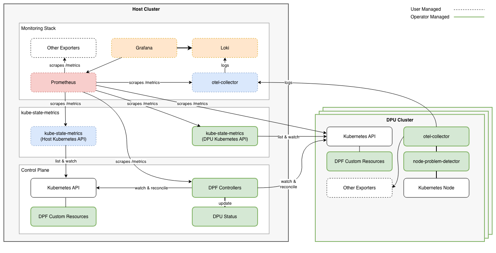

# DPF Observability

This section provides observability guidance for DPF, covering monitoring, logging, and health checks across the Host Cluster and DPU clusters.

[[_TOC_]]

## Introduction

The DPF observability stack consists of two types of components:

* **User-Managed Components**: Infrastructure components that the user deploys and manages
* **DPF-Operator-Managed Components**: DPF-specific components and exporters that are deployed by default by the DPF operator

## Architecture Overview

The diagram above shows a reference observability architecture for DPF. This is a blueprint that can be adapted to the specific environment requirements.

### Component Topology

The architecture centralizes monitoring and logging on the Host Cluster:

**Host Cluster** (user-managed) - Central monitoring infrastructure:

* **Prometheus**: Scrapes and stores metrics from all clusters
* **Grafana**: Visualizes metrics with pre-configured DPF dashboards
* **Loki**: Aggregates and stores logs from Host and DPU clusters
* **OpenTelemetry Collector**: Receives logs from DPU clusters via OTLP
* **Kube-State-Metrics**: Exposes DPF custom resource metrics for the host cluster

**DPU Health Monitoring** (DPF-operator-managed) - Runtime operational status:

* **Operational Conditions**: Aggregated DPU health from Node-Problem-Detector, DPUService pods, DPUServiceInterfaces, and DPUServiceChains
* Continuous tracking of runtime health (DPUServices, DPUServiceInterfaces, DPUServiceChains, node health checks) after provisioning completes

**DPU Clusters** (DPF-operator-managed) - Per-cluster monitoring agents:

* **Kube-State-Metrics**: Exposes DPF Custom Resource metrics on the host cluster for objects deployed in the DPUCluster
* **Node-Problem-Detector**: Monitors node health and reports conditions
* **OpenTelemetry Collector**: Collects and forwards logs to Host Cluster

## Documentation

### Setup and Configuration

* **[DPF-Operator-Managed Components](deployment/operator-managed-components.md)** - Configure Kube-State-Metrics, Node-Problem-Detector, and OpenTelemetry Collector
* **[User-Managed Components](deployment/user-managed-components.md)** - Setup Prometheus, Grafana, Loki, dashboards, multi-cluster configuration, and integration with existing monitoring stacks
* **[Grafana Dashboards](dashboards/README.md)** - Pre-configured Grafana dashboards for fleet health, DPU detail, framework state, and performance
* **[Prometheus Rules](prometheus-rules/README.md)** - Reference alert and recording rule examples to deploy alongside the dashboards, plus an Alertmanager routing example
* **[DPU Operational Readiness](guides/operational-readiness.md)** - Monitor DPU health conditions and configure alerting

## Getting Started

**Note:** The DPF operator should be installed before the monitoring stack (kube-prometheus-stack, Loki) to ensure monitoring components can use ConfigMaps created by the operator.

### Installation Steps

1. **Install Helm prerequisites**: Follow [Helm Prerequisites](../../getting-started/helm-prerequisites.md) for pre-installation components (cert-manager, ArgoCD, etc.)
2. **Deploy DPF operator**: Install the operator which creates ConfigMaps required by the monitoring stack
3. **Install monitoring stack**: Install kube-prometheus-stack and Loki - see [Helm Prerequisites](../../getting-started/helm-prerequisites.md)
4. **Configure DPF-operator components**: See [DPF-Operator-Managed Components](deployment/operator-managed-components.md) for Kube-State-Metrics, Node-Problem-Detector, and OpenTelemetry Collector
5. **Access Grafana**: Port-forward and view pre-configured dashboards - see [User-Managed Components](deployment/user-managed-components.md#included-grafana-dashboards)
6. **Monitor DPU health**: View operational conditions - see [DPU Operational Readiness](guides/operational-readiness.md)

