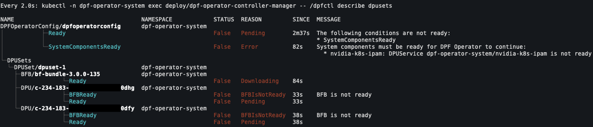

[TOC]

**`dpfctl`** is a command-line tool designed to **visualize, debug, and troubleshoot DPU resources** in Kubernetes.  
It simplifies debugging by extracting and presenting resource conditions in a structured, human-readable format.

It helps during provisioning and debugging of DPF by providing real-time visibility into resource states, conditions, and relationships.  
For example, during DPU provisioning you can quickly identify which resources are ready, which are failing, and understand the dependency chain between components.



## How to Run

There are 2 ways to run `dpfctl`:

* **Install**: You can download & run `dpfctl` locally on your machine
* **Execute Inside Kubernetes Pod**: With this way you can ensure that you are using the correct version of `dpfctl` that is
  compatible with the DPF Operator

## Available Commands

| Command                   | Description                                                     |
|---------------------------|-----------------------------------------------------------------|
| [describe](describe.md)   | Visualize and debug DPU resources, conditions, and dependencies |
| [sosreport](sosreport.md) | Collect SOS reports from host and DPU cluster nodes             |

### Install

To download the latest version of `dpfctl`, you can find the latest version [on NGC doca/dpfctl](https://catalog.ngc.nvidia.com/orgs/nvidia/teams/doca/resources/dpfctl).

There are 3 different versions available for different architectures:

* `dpfctl-linux-amd64`
* `dpfctl-linux-arm64`
* `dpfctl-darwin-arm64`

You can also download it directly from the command line (in this example we are using `dpfctl-linux-amd64` with version `v25.10.1`):

```shell
curl -L -o /usr/local/bin/dpfctl https://api.ngc.nvidia.com/v2/resources/nvidia/doca/dpfctl/versions/v25.10.1/files/dpfctl-linux-amd64
chmod +x /usr/local/bin/dpfctl
```

### Execute Inside Kubernetes Pod

To execute `dpfctl` from the running container:

```shell
kubectl -n dpf-operator-system exec deploy/dpf-operator-controller-manager -- /dpfctl describe all
```

#### Creating a Shell Alias

For convenience, you can create a shell alias to simplify your commands:

```shell
alias dpfctl="kubectl -n dpf-operator-system exec deploy/dpf-operator-controller-manager -- /dpfctl "
```

If you want to use `watch` according to `man watch`:

> If the last character of the alias value is a blank, then the next command word following the alias is also checked for alias expansion.

To use `watch` with custom arguments (like `-n1` for interval), add both aliases to your shell's configuration file (e.g., `.bashrc`, `.zshrc`, or `.profile`):

```shell
# Add to your shell's configuration file
alias dpfctl="kubectl -n dpf-operator-system exec deploy/dpf-operator-controller-manager -- /dpfctl "
alias watch="watch -c "
```

### Kubeconfig

By default, `dpfctl` uses the kubeconfig file at `~/.kube/config`. To use a different kubeconfig file, specify it with
`--kubeconfig`, which is part of the global flags:

```shell
dpfctl describe all --kubeconfig /path/to/kubeconfig
```

Alternatively, set the `KUBECONFIG` environment variable:

```shell
export KUBECONFIG=/path/to/kubeconfig
dpfctl describe all
```

or

```shell
KUBECONFIG=/path/to/kubeconfig dpfctl describe all
```

## Shell Completion

`dpfctl` supports shell completion for commands, flags, and flag values (e.g. resource kinds for
`--show-resources`, `--show-conditions`, and `--expand-resources`).

### Bash

Bash completion requires the [bash-completion](https://github.com/scop/bash-completion) package (v2+) and Bash 4.1+.

```shell
# Add to ~/.bashrc
command -v dpfctl >/dev/null && source <(dpfctl completion bash)
```

### Zsh

Zsh completion requires `compinit` to be enabled. If it is not already, add the following to your
`~/.zshrc` before the completion source line:

```shell
autoload -Uz compinit && compinit
```

Then add:

```shell
# Add to ~/.zshrc
command -v dpfctl >/dev/null && source <(dpfctl completion zsh)
```

### Fish

```shell
dpfctl completion fish > ~/.config/fish/completions/dpfctl.fish
```

### PowerShell

```powershell
# Add to your PowerShell profile
dpfctl completion powershell | Out-String | Invoke-Expression
```
