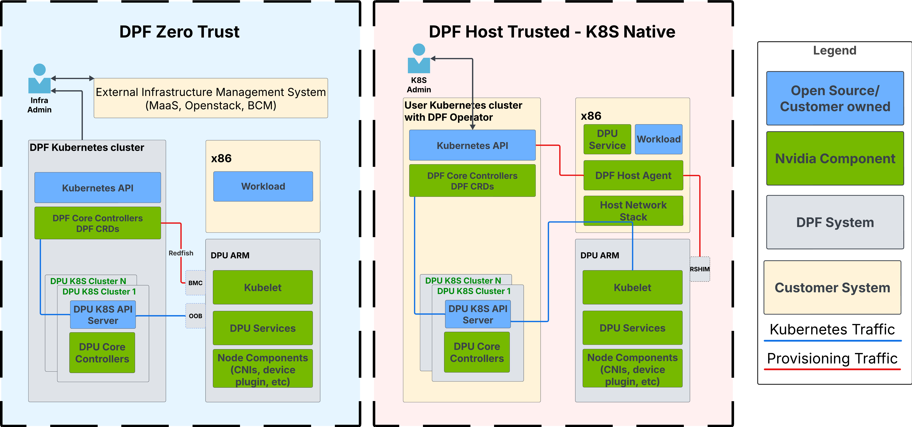

# DPF User Guides

These guides walk you through deploying and configuring the DOCA Platform Foundation (DPF) for different scenarios.

## Deployment Scenarios

We have two primary deployment scenarios for DPF -  Zero Trust and Host Trusted. Each scenario has its own
deployment guide and configuration details.

In the below diagram, you can see the differences between the two deployment modes:

### Zero Trust Deployment

[Zero Trust Guide](zero-trust/README.md)

In Zero Trust deployments, the DPU acts as a host accelerator card managed by DPF via BMC and Redfish. Your host
machines stay outside the DPF management cluster, while the DPU provides secure acceleration for those hosts.

This approach gives you:

* DPU managed through DPF via BMC and Redfish
* Secure isolation between management plane and host systems
* DPU services managed via Kubernetes APIs within the DPF cluster
* Ideal for isolation use cases: HBN, VPC, SNAP isolated storage, and Argus

### Host Trusted Deployment

[Host Trusted Guide](host-trusted/README.md)

In Host Trusted deployments, the DPU acts as a host accelerator card managed by the host. Your host machines function as
worker nodes within the DPF management cluster, with the DPU serving as an integrated acceleration resource.

This approach gives you:

* Host-managed DPU
* Standard Kubernetes APIs for both host workloads and DPU services
* End-to-end Kubernetes-native experience
* Support for HBN, OVN Kubernetes, and HBN+OVN Kubernetes use cases
* DPU configuration through DOCA Management Service (DMS)
